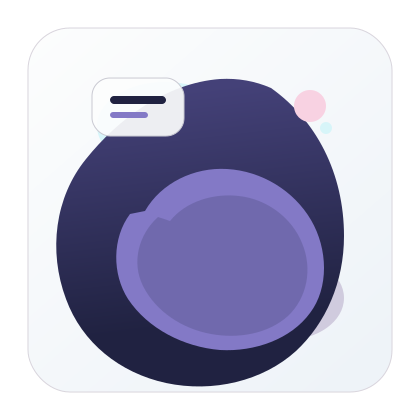
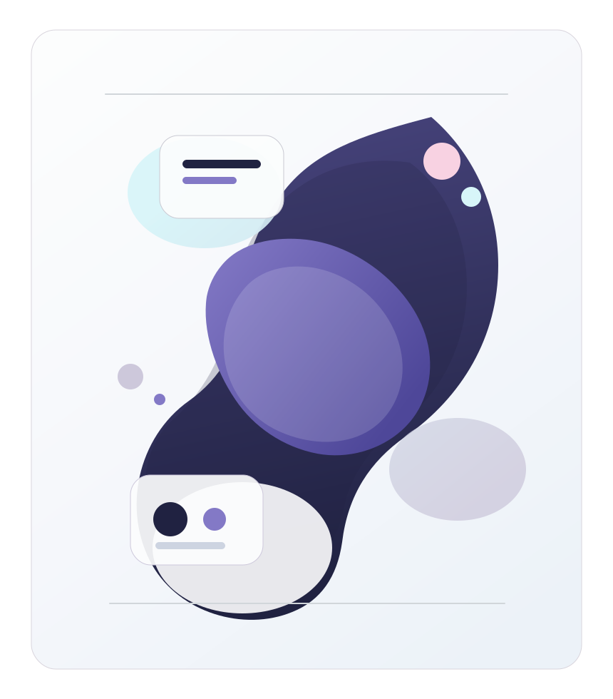

[中文](./README.md)

<table>
  <tr>
    <td width="54%" valign="top">
      

        
      

      <h1>VibeSkills</h1>
      

        <strong>Not another skills repository.</strong> 
        An AI agent system that integrates calling, governance, verification, and traceability into one working surface.
      

      

        
          <code>VibeSkills</code> is the public-facing name. <code>VCO</code> is the governed runtime behind it. 
          This visual direction is now derived from the author’s Gemini-generated SVG instead of a generic product-style mascot.
        
      

      <table>
        <tr>
          <td width="33%" valign="top">
            <strong>340</strong> 
            skills
          </td>
          <td width="33%" valign="top">
            <strong>19</strong> 
            upstreams
          </td>
          <td width="33%" valign="top">
            <strong>129</strong> 
            policies
          </td>
        </tr>
      </table>
      

        Closer to an editorial system cover than a plain repository parameter sheet.
      

    </td>
    <td width="46%" valign="top" align="center">
      
       
      The right-side art panel is a cropped and reorganized region from the author-provided Gemini SVG.
    </td>
  </tr>
</table>

> `VibeSkills` is not presenting a static directory of capabilities. It is presenting an AI system where scale, execution discipline, and governance density already live on the same surface.

`VibeSkills` is the public-facing name. `VCO` is the governed runtime behind it.

Right now, people feel the same pressure everywhere: too many AI tools, too many workflows, too many fast-moving resources, and no clear answer for how to choose, combine, learn, and keep up without falling behind.

`VibeSkills` is built for that reality.
It pulls together a frontier-grade toolset and manages those strong tools and resources through a complete, stable, and strict governance model, so what you face is not a pile of conflicting fragments, but a system that is easier to call, steadier to run, and much easier to maintain over time.

## Why It Feels Different Immediately

Most skill repositories answer one question: `what is available here?`

`VibeSkills` cares more about a different set of questions:

- what should be called now, instead of making you search the whole ecosystem yourself
- what should happen first, instead of letting the model sprint straight into execution
- which capabilities can be combined safely, and where boundaries need to stay explicit
- how results get verified, preserved, and kept out of long-term black-box decay

It is not about stacking more capability.
It is about integrating calling, governance, verification, and review into a system that can hold up under real use.

## System Surface

<table>
  <tr>
    <td width="33%" valign="top">
      <strong>Smart routing</strong> 
      Rule-based routing and AI-assisted routing work together so the right capability is more likely to appear in the right context.
    </td>
    <td width="33%" valign="top">
      <strong>Governed workflows</strong> 
      Clarification, confirmation, execution, verification, review, and traceability stay inside one working flow instead of collapsing into a black box.
    </td>
    <td width="33%" valign="top">
      <strong>Integrated capabilities</strong> 
      This is not just a pile of skills. It also carries plugins, project integrations, workflow design, AI norms, safety boundaries, and maintenance lessons.
    </td>
  </tr>
</table>

## The Real Problems It Tries To Solve

If you already use AI heavily, you have probably seen some version of these failures:

- too many skills, with no clear answer for which one fits the moment
- projects, plugins, and workflows that overlap and conflict with one another
- models that start executing before the task is actually clear
- work that ends without verification, evidence, or rollback surfaces
- a workflow that becomes more powerful over time, but also less understandable

`VibeSkills` does not pretend those problems disappear on their own.
Its value is that it takes them seriously and designs around them.

## Who It Is For

`VibeSkills` is mainly for:

- ordinary people who want AI to help more reliably
- heavy AI / Agent / automation users
- individuals or small teams that want more disciplined AI workflows
- anyone tired of a skill ecosystem that is rich in options but poor in usability

If you only want a single-purpose utility, this repo may be heavier than you need.
If you want AI to become steadier, easier to manage, and more useful over time, it is a much better fit.

## Quick Paths

<table>
  <tr>
    <td width="33%" valign="top">
      <strong>Understand the system</strong> 
      Start with the shortest overview before deciding whether this operating model fits you.  
      <a href="./docs/quick-start.en.md">Quick Start</a> 
      <a href="./docs/manifesto.en.md">Manifesto</a>
    </td>
    <td width="33%" valign="top">
      <strong>Install directly</strong> 
      If you are already ready to try it, jump to the public installation entry point.  
      <a href="./docs/install/one-click-install-release-copy.en.md">One-Click Install</a>
    </td>
    <td width="33%" valign="top">
      <strong>Go deeper</strong> 
      For fuller installation detail, cold-start paths, and the heavier-user onboarding surface.  
      <a href="./docs/install/recommended-full-path.en.md">Recommended Full Path</a> 
      <a href="./docs/cold-start-install-paths.en.md">Cold Start Paths</a>
    </td>
  </tr>
</table>

## In One Sentence

`VibeSkills` is not trying to sound more impressive.
It is trying to turn the most failure-prone part of real AI work into something more callable, more governable, more verifiable, and more maintainable over time.
