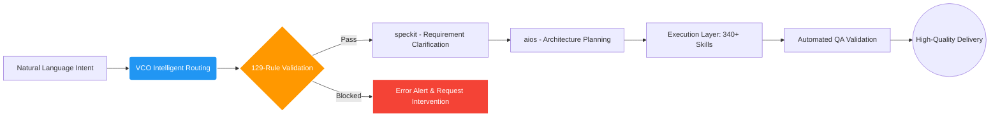

  <b>🇬🇧 English</b> | <a href="./README.md">🇨🇳 中文</a>

  

  

    
    
    
  

  
  

  

    
    
    
  

   

  <h3 align="center"><b>More than a skill collection. It is your personal AI operating system.</b></h3>
  

    An industrial-grade runtime framework integrating hundreds of Skills, MCP entry points, and governance rules.
  

  

    🧠 Planning · 🛠️ Engineering · 🤖 AI · 🔬 Research · 🧬 Life Sciences · 🎨 Visualization · 🎬 Multimedia
  

---

 

> [!IMPORTANT]
> **🎯 Our core vision:**
> Reduce the cognitive anxiety and high learning cost that come with every new technology wave. Here, whether or not you have a deep programming background, you can directly call on today's most advanced AI capabilities with an extremely low barrier to entry. **Let everyone enjoy the productivity leap that AI can bring.**

### 📊 Why is it so powerful?

**VibeSkills** runs on **VCO**. It is not a one-off utility or a script that only knows how to patch code. It is a highly integrated and governed **super-capability network**:

| 🧩 Skill Modules | 🌍 Ecosystem Integration | ⚖️ Governance Rules |
| :---: | :---: | :---: |
| <h2 align="center">340+</h2>
Directly callable Skills, covering the full chain from requirement planning to Execution. 
 | <h2 align="center">19+</h2>
High-value upstream open-source projects and best-practice sources absorbed and adapted
 | <h2 align="center">129</h2>
Configuration-based policies and contracts to keep execution stable, traceable, and resistant to drift
 |
---

## ✨ Why is it different?

Traditional Skills repositories answer: *"What tools do I have here?"* VibeSkills goes straight after the core pain point of serious AI users: *"How do I finish work reliably?"*

| ❌ Traditional pain points you may have lived through | ✅ The VibeSkills answer we are building |
| :--- | :--- |
| **Sleeping skills**: hundreds of capabilities sit in the repo, but in real scenarios the AI does not remember to use them. Activation stays low. | **🧠 Intelligent routing**: the system figures out what to call based on context and logic, so you do not need to memorize a skill catalog. |
| **Black-box sprinting**: the AI starts building before clarifying requirements. It looks fast, but the direction drifts, and the project slowly turns into a black box. | **🧭 Governed workflow**: the sequence is constrained on purpose. Clarification, verification, and traceability are folded into one unified flow, and every step stays auditable. |
| **Conflicting components**: plugins and workflows fight each other, pollute the environment, or fall into loops because nobody is coordinating them. | **🧩 Global governance**: 129 contract rules define safety boundaries and rollback mechanisms, protecting the runtime's long-term stability. |
| Messy Workspaces: AI workspaces often lack standardization. Over time, repositories become cluttered, hindering the next agent from taking over. Re-evaluating the architecture for a new agent leads to missed details and broken handoffs. |Semantic Directory Governance: Employs a standardized file storage architecture. It ensures that any work processed through this system is strictly organized, allowing the AI in subsequent sessions to instantly understand what files belong in which directories 👆. |
| AI Quirks & Illusions: Deleting primary files by mistake when clearing backups; a bad habit of writing silent fallback mechanisms, then confidently claiming early success while the primary functionality is actually quite poor. | Built-in Guardrails: Includes strict rules, such as prohibiting bulk file deletion via commands (forcing one-by-one deletion to prevent accidents). Silent automated fallbacks are banned; any necessary fallback must trigger an explicit warning to the user 👆. |
| High Cognitive Load: Users must rely on their own experience to regulate AI workflows, requiring steep learning curves and constant vigilance. | Guided Framework: The system actively guides the user through clarifying requirements, confirming execution plans, locking in workflow documents, and running concurrent multi-agents (allocating tasks and auto-invoking skills based on the plan), down to automated testing and iteration until the task is complete 👆. |

**With so many skills available, will the sheer number of options lead to a token explosion? Under the governance framework, this will certainly result in excessive token consumption, but not to the point of a token explosion. This is because routing doesn't provide the model with so many options; instead, it's triggered based on the user's task. The core logic is: user command - AI-assisted governance discovers keywords representing user intent - keywords trigger skill routing, and so on.**
---

## ✦ Panoramic Capability Map: Your all-in-one workspace

If you unfold these 340 skills along real-world workflows, VibeSkills has already laid out an end-to-end capability chain for you.
 
| Capability Domain | Covered Work Surface | Representative Engines |
| :--- | :--- | :--- |
| **💡 Requirements and clarification** | Refuse black-box starts. Turn vague ideas into clear, testable problem definitions with boundaries. | `brainstorming`, `speckit-clarify` |
| **📋 Planning and decomposition** | Break large goals into specs, plans, tasks, milestones, and execution flows. | `writing-plans`, `speckit-specify`, `aios-po` |
| **🏗️ Architecture and selection** | Design frontend/backend boundaries, interfaces, data layers, deployment layers, and technical tradeoffs. | `aios-architect`, `architecture-patterns` |
| **💻 Development and implementation** | Build new features, scaffold projects, integrate engineering systems, and land precise cross-file changes. | `autonomous-builder`, `speckit-implement` |
| **🔧 Debugging and refactoring** | Go beyond surface patching. Locate failures, analyze root causes, and restore project-level maintainability. | `error-resolver`, `systematic-debugging` |
| **🛡️ Testing and quality control** | Unit tests, regression validation, and quality gates so "verify before completion" is enforced in practice. | `tdd-guide`, `aios-qa`, `code-review` |
| **🚀 Collaboration and release** | Handle issues, PRs, CI repairs, review feedback, and automated deployment. | `aios-devops`, `gh-fix-ci`, `vercel-deploy` |
| **🤖 Composite workflows** | Freeze requirements, dispatch work, coordinate multiple agents, keep execution traces, and clean environments. | `vibe`, `swarm_*`, `hive-mind-advanced` |
| **🔌 External ecosystem access** | Connect browsers, web extraction, design files, third-party services, and context memory. | `mcp-integration`, `playwright`, `scrapling` |
| **📊 Data and AI engineering** | Covers EDA, cleaning, statistics, model training, RAG retrieval, and experiment tracking. | `senior-ml-engineer`, `statistical-analysis` |
| **🔬 Research and life sciences** | **A standout domain**: literature review, bioinformatics, single-cell analysis, and drug discovery. | `literature-review`, `biopython`, `scanpy` |
| **📐 Mathematics and professional computing** | Symbolic derivation, Bayesian modeling, multi-objective optimization, simulation, and even quantum computing. | `sympy`, `pymc-bayesian-modeling`, `qiskit` |
| **🎨 Multimedia and presentation** | Interactive charts, scientific figures, image generation, speech synthesis, and video asset production. | `plotly`, `generate-image`, `video-studio` |
 

<b>👉 Click to expand: Explore the full 340+ full-stack capability matrix of VibeSkills</b>

 
<blockquote>
<i>💡 <b>Why governance matters</b>: this large skill library is not a stagnant pile of isolated scripts. It is an ecosystem managed by the VCO runtime. Through domain-matrix classification, the system can automatically wake up the right tool at the right context boundary, without making you manually traverse the catalog.</i>
</blockquote>

### 🧠 Requirements, planning, and product management
> **🎯 Make big ideas executable**: cover requirement insight, problem definition, sprint planning, task decomposition, and constraint collection. The goal is to make sure the direction is clear, the boundaries are explicit, and milestones are testable before the first line of code is written.

`.system`, `aios-pm`, `aios-po`, `aios-sm`, `aios-squad-creator`, `aios-ux-design-expert`, `brainstorming`, `create-plan`, `designing-experiments`, `planning-with-files`, `shared-templates`, `speckit-analyze`, `speckit-checklist`, `speckit-clarify`, `speckit-constitution`, `speckit-plan`, `speckit-specify`, `speckit-tasks`, `speckit-taskstoissues`, `subagent-driven-development`, `think-harder`, `treatment-plans`, `ux-researcher-designer`, `writing-plans`

---

### 🛠️ Software engineering and architecture design
> **🎯 A real engineering foundation**: from scaffolding, cross-file modification, and API design to microservice architecture evaluation. It does not just produce code. It also manages context memory, toolchain orchestration, and multi-stage collaboration among intelligent agents.

`aios-architect`, `aios-dev`, `aios-master`, `architecture-patterns`, `autonomous-builder`, `cancel-ralph`, `coding-tutor`, `context-fundamentals`, `context-hunter`, `cs-foundations`, `deepagent-memory-fold`, `deepagent-toolchain-plan`, `evaluating-code-models`, `get-available-resources`, `hive-mind-advanced`, `local-vco-roles`, `node-zombie-guardian`, `nowait-reasoning-optimizer`, `prompt-lookup`, `ralph-loop`, `skill-creator`, `skill-lookup`, `spec-kit-vibe-compat`, `speckit-implement`, `superclaude-framework-compat`, `theme-factory`, `vibe`, `webthinker-deep-research`

---

### 🔧 Debugging, testing, and quality assurance
> **🎯 Protect the lifeline of code and systems**: covers unit testing, root-cause analysis, dependency conflict resolution, security review, and a full TDD-style testing workflow so the system can get out of the "change it and it breaks" black-box state.

`aios-qa`, `build-error-resolver`, `code-review`, `code-review-excellence`, `code-reviewer`, `data-quality-checker`, `data-quality-frameworks`, `debugging-strategies`, `deslop`, `detecting-performance-regressions`, `error-resolver`, `evals-context`, `experiment-failure-analysis`, `generating-test-reports`, `ml-data-leakage-guard`, `performance-testing`, `property-based-testing`, `providing-performance-optimization-advice`, `receiving-code-review`, `requesting-code-review`, `reviewing-code`, `security-best-practices`, `security-ownership-map`, `security-reviewer`, `security-threat-model`, `systematic-debugging`, `tdd-guide`, `verification-before-completion`, `verification-quality-assurance`, `windows-hook-debugging`

---

### 📊 Data analysis and statistical modeling
> **🎯 Let data tell the facts**: provides a one-stop data-processing engine covering cleaning, missing-value handling, exploratory data analysis, advanced statistical testing, regression models, and time-series forecasting.

`aios-data-engineer`, `anomaly-detector`, `correlation-analyzer`, `dask`, `data-artist`, `data-exploration-visualization`, `data-normalization-tool`, `detecting-data-anomalies`, `excel-analysis`, `exploratory-data-analysis`, `feature-importance-analyzer`, `geopandas`, `hypothesis-testing`, `metric-calculator`, `networkx`, `performing-causal-analysis`, `performing-regression-analysis`, `polars`, `preprocessing-data-with-automated-pipelines`, `regression-analysis-helper`, `running-clustering-algorithms`, `scientific-data-preprocessing`, `splitting-datasets`, `spreadsheet`, `statistical-analysis`, `statistics-math`, `statsmodels`, `usfiscaldata`, `vaex`, `xlsx`

---

### 🤖 Machine learning and AI engineering
> **🎯 A full-stack AI model development stack**: goes far beyond calling APIs. It reaches into feature engineering, model training, fine-tuning, interpretability analysis, LLM evaluation, and reinforcement learning workflows.

`LQF_Machine_Learning_Expert_Guide`, `aeon`, `datamol`, `deepchem`, `embedding-strategies`, `engineering-features-for-machine-learning`, `evaluating-llms-harness`, `evaluating-machine-learning-models`, `explaining-machine-learning-models`, `geniml`, `ml-pipeline-workflow`, `openai-knowledge`, `pufferlib`, `pytorch-lightning`, `scikit-learn`, `scikit-survival`, `senior-computer-vision`, `senior-data-scientist`, `senior-ml-engineer`, `senior-prompt-engineer`, `shap`, `similarity-search-patterns`, `sparse-autoencoder-training`, `stable-baselines3`, `tensorboard`, `timesfm-forecasting`, `torch-geometric`, `torch_geometric`, `torchdrug`, `training-machine-learning-models`, `transformer-lens-interpretability`, `transformers`, `umap-learn`, `unsloth`, `weights-and-biases`

---

### 🧬 Life sciences and bioinformatics computing
> **🎯 A seriously powerful interdisciplinary toolset**: deeply integrates single-cell sequencing analysis, protein structure folding, drug molecule discovery, and genomics alignment, while connecting cleanly to many kinds of cloud biology lab systems.

`adaptyv`, `alphafold-database`, `anndata`, `arboreto`, `benchling-integration`, `biopython`, `bioservices`, `cellxgene-census`, `cobrapy`, `deeptools`, `diffdock`, `dnanexus-integration`, `esm`, `etetoolkit`, `flowio`, `gene-database`, `gget`, `ginkgo-cloud-lab`, `gtars`, `histolab`, `imaging-data-commons`, `labarchive-integration`, `lamindb`, `latchbio-integration`, `matchms`, `medchem`, `molfeat`, `neurokit2`, `neuropixels-analysis`, `omero-integration`, `opentrons-integration`, `pathml`, `protocolsio-integration`, `pydeseq2`, `pydicom`, `pyhealth`, `pylabrobot`, `pyopenms`, `pysam`, `pytdc`, `rdkit`, `scanpy`, `scikit-bio`, `scvi-tools`, `tiledbvcf`

---

### 🔬 Scientific computing and mathematical logic
> **🎯 Precise derivation and complex-system simulation**: provides symbolic mathematics, Bayesian probabilistic programming, quantum-computing simulation, multi-objective optimization, and rigorous propositional-logic and mathematical-proof assistance.

`astropy`, `cirq`, `dialectic`, `fluidsim`, `gradient-methods`, `math`, `math-model-selector`, `math-tools`, `mathematical-logic-expert`, `matlab`, `pennylane`, `pymatgen`, `pymc`, `pymc-bayesian-modeling`, `pymoo`, `propositional-logic`, `qiskit`, `qutip`, `rowan`, `simpy`, `sympy`, `xan`

---

### 📚 Research literature and academic writing
> **🎯 A high-speed lane for academic productivity**: spans precise search across dozens of scientific databases such as PubMed and arXiv, review-matrix organization, citation management, and a full publication workflow from drafting and revision to peer review.

`bgpt-paper-search`, `biorxiv-database`, `brenda-database`, `chembl-database`, `citation-management`, `clinical-decision-support`, `clinical-reports`, `clinicaltrials-database`, `clinpgx-database`, `clinvar-database`, `comprehensive-research-agent`, `content-research-writer`, `cosmic-database`, `datacommons-client`, `documentation-lookup`, `drugbank-database`, `ena-database`, `ensembl-database`, `fda-database`, `geo-database`, `gwas-database`, `hmdb-database`, `hypothesis-generation`, `kegg-database`, `literature-matrix`, `literature-review`, `manuscript-as-code`, `market-research-reports`, `metabolomics-workbench-database`, `open-notebook`, `openalex-database`, `opentargets-database`, `paper-2-web`, `pdb-database`, `peer-review`, `pubchem-database`, `pubmed-database`, `pyzotero`, `reactome-database`, `research-grants`, `research-lookup`, `scholar-evaluation`, `scholarly-publishing`, `scientific-brainstorming`, `scientific-critical-thinking`, `scientific-reporting`, `scientific-writing`, `string-database`, `submission-checklist`, `uniprot-database`, `uspto-database`, `zinc-database`

---

### 🎨 Multimedia, visualization, and documents
> **🎯 Make knowledge and data visible**: covers interactive chart generation, publication-grade scientific figures, slide creation, audio/video production, and deep read/write and parsing support for office documents such as Word and PDF.

`algorithmic-art`, `creating-data-visualizations`, `data-storytelling`, `datavis`, `doc`, `docs-review`, `docs-write`, `document-skills`, `docx`, `docx-comment-reply`, `figma`, `figma-implement-design`, `file-organizer`, `g2-legend-expert`, `generate-image`, `imagegen`, `infographics`, `latex-posters`, `latex-submission-pipeline`, `markdown-mermaid-writing`, `markitdown`, `matplotlib`, `pdf`, `plotly`, `pptx-posters`, `report-generator`, `scientific-schematics`, `scientific-slides`, `scientific-visualization`, `screenshot`, `seaborn`, `slides-as-code`, `smart-file-writer`, `speech`, `structured-content-storage`, `transcribe`, `venue-templates`, `video-studio`, `visualization-best-practices`, `vscode-release-notes-writer`, `writing-docs`

---

### 🔌 External integrations, automation, and deployment
> **🎯 Break through runtime boundaries**: connect to external browsers, design platforms, and cloud services through MCP and Playwright-style automation, while supporting CI/CD pipelines and one-click deployment.

`aios-devops`, `alpha-vantage`, `claude-skills`, `commit-with-reflection`, `denario`, `digital-brain`, `edgartools`, `flashrag-evidence`, `fred-economic-data`, `geomaster`, `gh-address-comments`, `gh-fix-ci`, `hedgefundmonitor`, `hypogenic`, `iso-13485-certification`, `jupyter-notebook`, `knowledge-steward`, `mcp-integration`, `modal`, `modal-labs`, `netlify-deploy`, `openai-docs`, `perplexity-search`, `playwright`, `prowler-docs`, `scrapling`, `sentry`, `skypilot-multi-cloud-orchestration`, `vercel-deploy`

---

## 👥 Who is it for?

* 🎯 **Everyday people who want stable delivery**: you want AI to be a reliable partner, not a runaway horse.
* ⚡ **Advanced power users who rely heavily on AI and agents**: you need a unified foundation that can carry large workflows.
* 🏢 **Small teams with stronger process requirements**: you want AI workflows that are easier to maintain and easier to pass on.
* 😩 **Practitioners tired of "skill pileups"**: you are done hunting for tools and just want a solution that works out of the box.

*If all you want is one tiny script, this may be too much. But if you want to use AI more steadily, more smoothly, and for the long run, this becomes hard to replace.*

---

## 🧭 Deep dive into capability clusters: reject isolated dots

The biggest advantage of VibeSkills is its **systematic governance and standardization**. This is not a pile of scattered skills. It is an upstream-to-downstream work chain with tight handoffs.

* **🧩 Planning, architecture, and engineering implementation**
    Start with requirement interviews and constraint collection, move through task breakdown and architecture selection, and land in precise cross-file changes. At the same time, quality gates stay enforced, covering root-cause-level refactors and maintainability-oriented review.
* **🔗 Collaborative governance and capability activation**
    Solve the "sleeping capability" problem. Through **intelligent routing** and **governed workflows**, the right MCP or plugin is activated at the right stage. The execution trail is fully recorded and can be turned into high-quality knowledge artifacts automatically.
* **🔬 Data, research, and high-bar professional computing**
    Go beyond ordinary coding. VibeSkills provides a complete **research and academic writing loop**, a deeply integrated **life-sciences toolchain**, and scientific-computing engines that support complex modeling.

We reject black-box execution. Vibe-Skills strictly follows a `clarify ➔ plan ➔ execute ➔ verify` directed acyclic graph (DAG) architecture.

---

## 🎯 If you state a need directly, how does VibeSkills take over?

These examples are not abstract capability descriptions. They are much closer to real usage. You do not need to memorize the whole skills table first. If you can state the goal clearly, VibeSkills will try to decompose the task in the right order, activate the right capabilities, and turn the result into a deliverable that can keep being used.

### 🛠️ For engineering teams

- **If a user asks:** "Help me refactor this old project and fix the red CI checks while you're at it."
  **VibeSkills will:** clarify the boundary of the refactor first, map the affected modules, locate the failing checks, and then move through edits and verification in a governed sequence.
  **It will activate:** `speckit-clarify`, `aios-dev`, `aios-devops`, `gh-fix-ci`, `verification-before-completion`
  **Final deliverable:** a reviewable set of code changes, a repaired check pipeline, and verification evidence you can audit later.

- **If a user asks:** "I don't understand this error. Help me find the root cause and fix it."
  **VibeSkills will:** reproduce the issue first, run systematic debugging, narrow the root-cause range, and add the smallest valid fix plus regression verification instead of changing code blindly.
  **It will activate:** `error-resolver`, `systematic-debugging`, `debugging-strategies`, `tdd-guide`
  **Final deliverable:** a root-cause explanation, a targeted fix, and verification evidence proving the problem is resolved.

### 📈 For product and growth teams

- **If a user asks:** "Help me do competitor research and see how people in this space have been approaching the problem lately."
  **VibeSkills will:** clarify the scope and comparison dimensions first, gather public information, organize a structured comparison, and generate an analysis artifact that looks like a real working document instead of a loose note dump.
  **It will activate:** `speckit-clarify`, `scrapling`, `playwright`, `aios-analyst`, `market-research-reports`
  **Final deliverable:** a competitor summary, a comparison framework, key judgments, and a research report that can be used directly.

- **If a user asks:** "I only have one fuzzy idea. Help me turn it into an executable growth plan."
  **VibeSkills will:** clarify the target audience, constraints, and success criteria first, then break the work into a requirement frame, analysis path, and implementation advice instead of throwing out vague ideas.
  **It will activate:** `brainstorming`, `aios-pm`, `aios-analyst`, `report-generator`
  **Final deliverable:** a clearer problem definition, structured strategy recommendations, and a plan document that is easy to continue executing.

### 🔬 For research and bioinformatics users

- **If a user asks:** "Help me write a literature review in this area and organize it into a framework I can continue researching."
  **VibeSkills will:** define the search boundary and question focus first, then handle literature search, organization, citation management, and review structure design.
  **It will activate:** `literature-review`, `research-lookup`, `citation-management`, `scientific-writing`
  **Final deliverable:** a review framework you can continue expanding, a citation list, and follow-on research entry points.

- **If a user asks:** "I have a batch of single-cell data. I want a quick analysis and I want to find signals worth following up on."
  **VibeSkills will:** confirm the data shape and analysis goals first, enter the single-cell analysis workflow, and then organize the results, visualizations, and first-pass interpretation.
  **It will activate:** `scanpy`, `scvi-tools`, `anndata`, `scientific-visualization`
  **Final deliverable:** an analysis workflow, key figure outputs, and preliminary conclusions you can continue digging into.

---

## 📦 Gather the strengths of many projects: integration and full matrix

We know that building in isolation cannot keep up with the speed of the AI era. The core confidence behind VibeSkills comes from continuously absorbing the most mature methods and architectures from the open-source community, then bringing them into one unified governance and orchestration system.

> 🙏 **Special thanks and credit**
> This project continuously integrates, absorbs, and governs the core strengths of the following outstanding open-source projects:
>
> `superpower` · `claude-scientific-skills` · `get-shit-done` · `aios-core` · `OpenSpec` · `ralph-claude-code` · `SuperClaude_Framework` · `spec-kit` · `Agent-S` · `mem0` · `scrapling` · `claude-flow` · `serena` · `everything-claude-code` · `DeepAgent` and more
>
> *Thank you to all of these authors for their generous work. Without those bright sources of inspiration, VibeSkills would not exist. While integrating strengths from many repositories, we have tried hard to handle attribution and redistribution responsibly. If anything has been missed, please raise it in an Issue and we will correct and supplement it as quickly as possible.*

---

## 🚀 Start your Vibe experience

⚠️ **Invocation note**: to stay compatible with general-purpose agents, this project uses a **Skills-format architecture**. Please activate it through your host environment's Skills invocation flow. **Do not** run it directly as a standalone CLI program.
* In **Claude Code**, type: `/vibe`
* In **Codex**, type: `$vibe`
* The usage is the same as calling skills, such as in Codex: "I want you to design a XXXX $vibe". In Claude Code, it would be: "I want you to design a XXX /vibe". Then, in each round, you need to input the displayed vibe call (ensuring each round is under the management of vibeskills), such as: "I want to complete the subsequent tasks according to this plan $vibe".

### 📚 Navigation and guides

**Get familiar with the system quickly**
* 📖 [Understand the system architecture and philosophy](./docs/quick-start.md)
* 📜 [VibeSkills manifesto](./docs/manifesto.md)

**Installation and configuration guide**
* Current public support surface: **Claude Code and Codex only**
* ⚡️ [Prompt-based install (recommended default)](./docs/install/one-click-install-release-copy.en.md)
  The prompt now explicitly distinguishes Codex base online provider settings (`OPENAI_*`) from the governance AI online layer (`VCO_AI_PROVIDER_*`), and requires the assistant to explain what those fields do, why they matter, and where they must be configured locally.
* 📁 [Manual copy install (offline / no-admin)](./docs/install/manual-copy-install.en.md)

**Advanced references**
* 🛠 [Advanced host and lane reference](./docs/install/recommended-full-path.en.md)
* 🧊 [Cold-start and other environment notes](./docs/cold-start-install-paths.en.md)

Welcome everyone to try it out and experience it for yourselves! I'd love to hear your thoughts, so please feel free to start discussions and share your feedback or suggestions. I know I'm far from perfect, so if you spot any issues or areas for improvement, please don't hesitate to point them out—I'm all ears and will definitely make the necessary fixes.

This project is open source, and contributions from everyone are welcome! Whether you want to fix bugs, improve performance, add new features, or enhance documentation, your feedback is invaluable. Simply fork this repository, make your changes, and submit a pull request. We appreciate contributions at all levels; your efforts will help improve this tool and benefit everyone.

If you like the project, please consider giving it a star! I'll be continuously updating it. Your support is the enriched U-235 to this nuclear-powered donkey!

Thanks to everyone on LinuxDo for their support! Welcome to join https://linux.do/ for all kinds of technical exchanges, cutting-edge AI information, and AI experience sharing!
---

---

  
<i>Turn the most failure-prone parts of real work into a system that is more callable, more governable, and more maintainable over the long term.</i>

