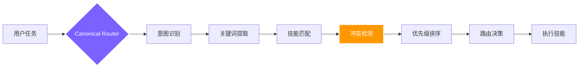

<div align="right">
  <a href="./README.en.md">🇬🇧 English</a> | <b>🇨🇳 中文</b>
</div>

<div align="center">
  <a href="https://github.com/foryourhealth111-pixel/Vibe-Skills">
    
  </a>

  <p align="center">
    <a href="https://github.com/foryourhealth111-pixel/Vibe-Skills/stargazers">
      
    </a>
    <a href="https://github.com/foryourhealth111-pixel/Vibe-Skills/network/members">
      
    </a>
    <a href="https://github.com/foryourhealth111-pixel/Vibe-Skills/pulse">
      
    </a>
    <a href="https://gitcgr.com/foryourhealth111-pixel/Vibe-Skills">
      
    </a>
  </p>
  
  
  
  <p align="center">
    
    
    
  </p>

  <br/>

  <h3 align="center"><b>不只是技能集合，更是你的个人 AI 操作系统</b></h3>
  <p align="center">
    集成数百个 Skills、MCP 入口与治理规则的工业级运行时框架。
  </p>

  <p align="center">
    <sub>🧠 规划 · 🛠️ 工程 · 🤖 AI · 🔬 科研 · 🧬 生命科学 · 🎨 可视化 · 🎬 多媒体</sub>
  </p>
</div>

---

<br/>

> [!IMPORTANT]  
> **🎯 我们的核心愿景:**
> Vibe Skills将与时俱进，一方面保证好用提升效率，一方面降低前沿的vibecoding技术对于大众的学习探索成本，降低面对新技术的认知焦虑与高昂的学习成本。
> 在这里，无论你是否具备深厚的编程基础，都能以极低的门槛，直接调用当今最前沿的 AI 技术集合。**让每个人都能享受 AI 带来的生产力飞跃。**

### 📊 为什么说它强大？

**VibeSkills** 背后的运行时核心是 **VCO**。它绝不仅仅是一个单点工具或只会“补代码”的脚本，而是一个已经完成高度整合与治理的**超级能力网络**：

|                                                🧩 技能模块                                                |                                           🌍 生态融合                                           |                                                ⚖️ 治理规则                                                 |
| :-------------------------------------------------------------------------------------------------------: | :---------------------------------------------------------------------------------------------: | :--------------------------------------------------------------------------------------------------------: |
| <h2 align="center">340+</h2><div align="center">可直接调用的 Skills，覆盖从需求规划到执行的完整链路</div> | <h2 align="center">19+</h2><div align="center">吸收与借鉴高价值上游开源项目与最佳实践来源</div> | <h2 align="center">129 条</h2><div align="center">基于配置的策略与契约，确保执行稳定、可溯源、防发散</div> |

---

## ✨ 为什么它与众不同？

传统的 Skills 仓库在回答：_“我这里有什么工具？”_ 而 VibeSkills 正面迎击的是重度 AI 用户的核心痛点：_“我该怎么稳定地完成工作？”_

| ❌ 传统痛点（你可能经历过）                                                                                                                                                            | ✅ VibeSkills 解法（我们正在做）                                                                                                                                                     |
| :------------------------------------------------------------------------------------------------------------------------------------------------------------------------------------- | :----------------------------------------------------------------------------------------------------------------------------------------------------------------------------------- |
| **技能沉睡**：仓库里几百个能力，真实场景下 AI 根本想不起来用，激活率极低。                                                                                                             | **🧠 智能路由**：现在该调什么，系统会根据上下文和逻辑自动路由拉起，无需你翻背技能表。                                                                                                |
| **黑盒狂奔**：AI 不澄清需求就直接开做，速度快但方向偏，项目逐渐变成黑盒。                                                                                                              | **🧭 受管工作流**：先做什么再做什么被严格约束。将澄清、验证、留痕收进统一流程，每步可溯源。                                                                                          |
| **互相冲突**：不同插件和工作流之间缺乏统筹，导致环境污染或死循环。                                                                                                                     | **🧩 全局治理**：通过 129 条契约规则，设定安全边界与回退机制，保障整个运行时的长期稳定性。                                                                                           |
| AI的工作区往往不够规范，工作久了之后仓库容易脏乱差，影响下一个agent接手工作区。在开一个新agent管理工作项目时，重新理解工作区的架构会遗漏一些项目细节，导致后面工作和前面工作衔接有问题 | 使用了一套文件目录语义治理。保证只要工作经过这个项目的治理，按固定化的架构存储文件，让下一个新的对话的AI明白什么什么目录下存储什么什么文件                                           |
| AI诸多的小毛病：为删除备份，把主要文件删了；喜欢写静默的兜底机制，然后早早的自信满满的给你说做好了，实际上全是兜底机制在发力，主要功能实现度度很差                                     | 内置了一些治理，如上述的禁止按命令批量删除文件，只能一个文件一个文件的删除，防止误删文件。禁止写自动静默兜底机制，如果要写兜底机制，一定要显示有明确的警告用户                       |
| 用户需要依据经验自己规范与AI的工作流，需要学习和保持警觉                                                                                                                               | 框架会引导用户，从沟通好需求，沟通好落实计划，固定好工作步骤文件，多代理并发执行（同时会按照计划，不同的代理分配不同的工作，各自会自动调用相关的skills），自动测试迭代，直到任务完成 |

### 关于Token消耗的说明

**集合了这么多skills，是否会因为选项过多导致token爆炸？**

在治理框架下会有额外的token消耗（约30k的初始上下文），但不会导致token爆炸。因为路由不是简单地把所有选项都抛给模型，而是采用智能触发机制：**用户命令 → AI辅助治理发掘意图关键词 → 关键词触发技能路由**。

---

## 🔀 智能路由机制：340+技能如何协同而不冲突

面对340+技能，你可能会担心：_"这么多相似的技能，会不会互相打架？系统怎么知道该用哪个？"_

### 路由如何工作

VibeSkills 使用 **Canonical Router（权威路由器）** 作为唯一的路由决策中心：



### 为什么这样设计？

传统的技能仓库让AI"自由选择"，结果是：
- ❌ AI记不住有哪些技能
- ❌ 相似技能互相冲突
- ❌ 执行路径不可预测

VibeSkills的路由机制确保：
- ✅ **确定性**：相同任务总是走相同的路由逻辑
- ✅ **可追溯**：每次路由决策都有明确的理由
- ✅ **可控性**：用户可以通过显式调用（如 `/vibe`）覆盖默认路由
- ✅ **稳定性**：129条治理规则防止冲突和发散


### M/L/XL 执行级别

路由器在选择主技能后，还会根据任务复杂度自动判断执行级别：

- **M（Medium）**：窄范围执行，通常是单代理或边界很清楚的小范围工作
- **L（Large）**：需要设计、计划、评审和受控子代理协作的中等复杂任务
- **XL（Extra Large）**：适合可并行、长流程、需要多代理分波次推进的大任务（对于多代理会自动分发相关任务的对应skills）

这三个级别是**内部执行级别**，系统会在需求澄清之后、计划执行之前，根据任务复杂度、并行性和治理需求自动选择。用户只需调用 `/vibe` 或 `$vibe`，系统会自动判断该走哪个级别。

**级别选择逻辑**：
- 默认情况下，路由会根据任务内容自动判断
- `L` 更克制、通常更省 token
- `XL` 更偏向"用更多 token 换并行度和执行时间"

**显式偏好**：你也可以在请求中表达级别偏好，例如：
```text
我希望你按照计划执行这个任务，启动 XL 级工作流 /vibe
```

这种写法的含义更接近于"给路由一个明确偏好提示"，而不是绕过治理层直接强制切档。


### 一次路由一个还是多个？
<details>
  
**核心原则：一次任务通常路由到一个主技能，但该技能可以调用其他技能作为子流程。**

- **单一主路由**：对于用户的一个明确任务，Canonical Router 会选择**一个最匹配的主技能**
- **技能组合**：主技能在执行过程中，可以根据需要调用其他技能（如 `vibe` 可以调用 `speckit-clarify`、`aios-architect` 等）
- **受管协同**：多个技能的协同由治理规则控制，而不是随意组合

</details>
  

### 相似技能的冲突处理会如何处理？

<details>
  
当多个技能看起来都能完成任务时，路由器通过以下机制避免冲突：

#### 1. **优先级规则**
每个技能都有明确的优先级和适用场景：
- `vibe`：受管工作流，需要完整的需求澄清和计划执行
- `autonomous-builder`：自主构建，适合明确的开发任务
- `speckit-implement`：规范化实现，适合有明确spec的场景

#### 2. **上下文匹配**
路由器会分析：
- 任务的复杂度（简单修改 vs 复杂项目）
- 是否需要多阶段执行
- 是否需要多代理协同
- 用户的显式偏好（如使用 `/vibe` 显式调用）

#### 3. **互斥规则**
129条治理规则中包含互斥规则，例如：
- 不能同时运行多个会修改同一文件的技能
- 不能同时运行冲突的工作流模式
- 某些技能组合被明确禁止

#### 4. **降级和回退**
如果首选技能不可用或执行失败：
- 路由器会按优先级尝试备选技能
- 有明确的回退策略和错误处理
- 不会陷入死循环或无限重试

</details>

### 实际例子

<details>
  
**场景：用户说"帮我重构这个项目"**

1. **意图识别**：这是一个复杂的重构任务
2. **关键词提取**：重构、项目、代码质量
3. **技能匹配**：
   - 候选1：`vibe`（受管工作流，适合复杂任务）
   - 候选2：`autonomous-builder`（自主构建）
   - 候选3：`systematic-debugging`（系统化调试）
4. **冲突检测**：这些技能不冲突，但需要选择最合适的
5. **优先级排序**：
   - 如果用户使用了 `/vibe`，直接选择 `vibe`
   - 如果任务需要多阶段执行，选择 `vibe`
   - 如果任务边界清晰，可能选择 `autonomous-builder`
6. **路由决策**：选择 `vibe`，因为重构通常需要：
   - 需求澄清（哪些部分需要重构）
   - 计划制定（重构步骤）
   - 分阶段执行
   - 验证和测试

</details>

---


## ✦ 全景能力地图：你的全能工作台

如果把这 340 个 skills 按“真实工作流”展开，VibeSkills 已经为你铺设好了一条端到端的能力链。
<br/>
| 能力域 | 覆盖工作面 | 代表能力引擎 |
| :--- | :--- | :--- |
| **💡 需求与澄清** | 拒绝黑盒开局：把模糊想法转为边界清晰、可验收的问题定义 | `brainstorming`, `speckit-clarify` |
| **📋 规划与拆解** | 将宏大目标拆解为 spec、plan、tasks、里程碑与执行流 | `writing-plans`, `speckit-specify`, `aios-po` |
| **🏗️ 架构与选型** | 设计前后端边界、接口、数据层、部署层与技术路线对比 | `aios-architect`, `architecture-patterns` |
| **💻 开发与实现** | 新功能开发、脚手架搭建、工程化集成和跨文件精准落地 | `autonomous-builder`, `speckit-implement` |
| **🔧 调试与重构** | 告别表面缝补：定位报错、分析根因、恢复项目级可维护性 | `error-resolver`, `systematic-debugging` |
| **🛡️ 测试与品控** | 单元测试、回归验证、质量门禁，实现“完成前强制核验” | `tdd-guide`, `aios-qa`, `code-review` |
| **🚀 协作与发布** | 接管 Issue/PR、CI 修复、Review 处理与自动化部署 | `aios-devops`, `gh-fix-ci`, `vercel-deploy` |
| **🤖 复合工作流** | 冻结需求、任务分派、多 Agent 协同、执行留痕与环境清理 | `vibe`, `swarm_*`, `hive-mind-advanced` |
| **🔌 外部生态接入** | 打通浏览器、网页抓取、设计稿、第三方服务与上下文记忆 | `mcp-integration`, `playwright`, `scrapling` |
| **📊 数据与 AI 工程** | 涵盖 EDA、清洗统计，到模型训练、RAG 检索与实验跟踪 | `senior-ml-engineer`, `statistical-analysis` |
| **🔬 科研与生命科学** | **强势领域**：文献检索综述、生信分析、单细胞、药物发现 | `literature-review`, `biopython`, `scanpy` |
| **📐 数学与专业计算** | 符号推导、贝叶斯建模、多目标优化、仿真乃至量子计算 | `sympy`, `pymc-bayesian-modeling`, `qiskit` |
| **🎨 多媒体与展示** | 交互图表、科研绘图、图片生成、语音合成与视频素材生产 | `plotly`, `generate-image`, `video-studio` |
<br/>

<details>
<summary><b>👉 点击展开：探索 VibeSkills 完整的 340+ 全栈能力矩阵详解</b></summary>
<br/>
<blockquote>
<i>💡 <b>治理的意义</b>：以下庞大的技能库不是孤立的脚本死水，而是一个被 VCO 运行时接管的生态。通过领域矩阵分类，系统会在正确的上下文节点自动唤起正确的工具，无需你手动遍历调用。</i>
</blockquote>

### 🧠 需求、规划与产品管理

> **🎯 让大想法变得可落地**：负责需求洞察、问题定义、Sprint 规划、任务切分与约束收集。确保在写下第一行代码前，方向清晰、边界明确且具有可验收的里程碑。

`.system`, `aios-pm`, `aios-po`, `aios-sm`, `aios-squad-creator`, `aios-ux-design-expert`, `brainstorming`, `create-plan`, `designing-experiments`, `planning-with-files`, `shared-templates`, `speckit-analyze`, `speckit-checklist`, `speckit-clarify`, `speckit-constitution`, `speckit-plan`, `speckit-specify`, `speckit-tasks`, `speckit-taskstoissues`, `subagent-driven-development`, `think-harder`, `treatment-plans`, `ux-researcher-designer`, `writing-plans`

---

### 🛠️ 软件工程与架构设计

> **🎯 真正的工程化构建底座**：从脚手架搭建、跨文件修改、API 接口设计到微服务架构评估。不仅产出代码，更负责上下文记忆、工具链编排与智能 Agent 的多阶段协同执行。

`aios-architect`, `aios-dev`, `aios-master`, `architecture-patterns`, `autonomous-builder`, `cancel-ralph`, `coding-tutor`, `context-fundamentals`, `context-hunter`, `cs-foundations`, `deepagent-memory-fold`, `deepagent-toolchain-plan`, `evaluating-code-models`, `get-available-resources`, `hive-mind-advanced`, `local-vco-roles`, `node-zombie-guardian`, `nowait-reasoning-optimizer`, `prompt-lookup`, `ralph-loop`, `skill-creator`, `skill-lookup`, `spec-kit-vibe-compat`, `speckit-implement`, `superclaude-framework-compat`, `theme-factory`, `vibe`, `webthinker-deep-research`

---

### 🔧 调试、测试与质量保证

> **🎯 守住代码和系统的生命线**：涵盖单元测试、根因分析、依赖冲突解决、安全漏洞审查与全套 TDD 测试驱动指南，确保系统告别“改完就崩”的黑盒状态。

`aios-qa`, `build-error-resolver`, `code-review`, `code-review-excellence`, `code-reviewer`, `data-quality-checker`, `data-quality-frameworks`, `debugging-strategies`, `deslop`, `detecting-performance-regressions`, `error-resolver`, `evals-context`, `experiment-failure-analysis`, `generating-test-reports`, `ml-data-leakage-guard`, `performance-testing`, `property-based-testing`, `providing-performance-optimization-advice`, `receiving-code-review`, `requesting-code-review`, `reviewing-code`, `security-best-practices`, `security-ownership-map`, `security-reviewer`, `security-threat-model`, `systematic-debugging`, `tdd-guide`, `verification-before-completion`, `verification-quality-assurance`, `windows-hook-debugging`

---

### 📊 数据分析与统计建模

> **🎯 让数据讲述事实**：提供从数据清洗、缺失值处理、探索性分析（EDA）到高级统计检验、回归模型、时序预测的一站式数据处理引擎。

`aios-data-engineer`, `anomaly-detector`, `correlation-analyzer`, `dask`, `data-artist`, `data-exploration-visualization`, `data-normalization-tool`, `detecting-data-anomalies`, `excel-analysis`, `exploratory-data-analysis`, `feature-importance-analyzer`, `geopandas`, `hypothesis-testing`, `metric-calculator`, `networkx`, `performing-causal-analysis`, `performing-regression-analysis`, `polars`, `preprocessing-data-with-automated-pipelines`, `regression-analysis-helper`, `running-clustering-algorithms`, `scientific-data-preprocessing`, `splitting-datasets`, `spreadsheet`, `statistical-analysis`, `statistics-math`, `statsmodels`, `usfiscaldata`, `vaex`, `xlsx`

---

### 🤖 机器学习与 AI 工程

> **🎯 全链路 AI 模型开发栈**：不止于调用 API，更深入特征工程、模型训练、微调（Fine-tuning）、可解释性分析（SHAP）、大模型评估（Evals）与强化学习训练工作流。

`LQF_Machine_Learning_Expert_Guide`, `aeon`, `datamol`, `deepchem`, `embedding-strategies`, `engineering-features-for-machine-learning`, `evaluating-llms-harness`, `evaluating-machine-learning-models`, `explaining-machine-learning-models`, `geniml`, `ml-pipeline-workflow`, `openai-knowledge`, `pufferlib`, `pytorch-lightning`, `scikit-learn`, `scikit-survival`, `senior-computer-vision`, `senior-data-scientist`, `senior-ml-engineer`, `senior-prompt-engineer`, `shap`, `similarity-search-patterns`, `sparse-autoencoder-training`, `stable-baselines3`, `tensorboard`, `timesfm-forecasting`, `torch-geometric`, `torch_geometric`, `torchdrug`, `training-machine-learning-models`, `transformer-lens-interpretability`, `transformers`, `umap-learn`, `unsloth`, `weights-and-biases`

---

### 🧬 生命科学与生信计算

> **🎯 极其强悍的跨学科硬核利器**：深度集成单细胞测序分析、蛋白质结构折叠、药物分子发现、基因组学比对，并无缝对接各类云端生物实验室系统。

`adaptyv`, `alphafold-database`, `anndata`, `arboreto`, `benchling-integration`, `biopython`, `bioservices`, `cellxgene-census`, `cobrapy`, `deeptools`, `diffdock`, `dnanexus-integration`, `esm`, `etetoolkit`, `flowio`, `gene-database`, `gget`, `ginkgo-cloud-lab`, `gtars`, `histolab`, `imaging-data-commons`, `labarchive-integration`, `lamindb`, `latchbio-integration`, `matchms`, `medchem`, `molfeat`, `neurokit2`, `neuropixels-analysis`, `omero-integration`, `opentrons-integration`, `pathml`, `protocolsio-integration`, `pydeseq2`, `pydicom`, `pyhealth`, `pylabrobot`, `pyopenms`, `pysam`, `pytdc`, `rdkit`, `scanpy`, `scikit-bio`, `scvi-tools`, `tiledbvcf`

---

### 🔬 科学计算与数学逻辑

> **🎯 精确推导与复杂系统仿真**：提供符号数学演算、贝叶斯概率编程、量子计算模拟、多目标优化计算以及严格的命题逻辑与数理证明辅助。

`astropy`, `cirq`, `dialectic`, `fluidsim`, `gradient-methods`, `math`, `math-model-selector`, `math-tools`, `mathematical-logic-expert`, `matlab`, `pennylane`, `pymatgen`, `pymc`, `pymc-bayesian-modeling`, `pymoo`, `propositional-logic`, `qiskit`, `qutip`, `rowan`, `simpy`, `sympy`, `xan`

---

### 📚 科研文献与学术写作

> **🎯 学术生产力的高速公路**：横跨 PubMed/arXiv 等数十个科研数据库的精准检索、综述矩阵整理、引文管理系统，以及从论文起草、修改到同行评审的完整出版物流程。

`bgpt-paper-search`, `biorxiv-database`, `brenda-database`, `chembl-database`, `citation-management`, `clinical-decision-support`, `clinical-reports`, `clinicaltrials-database`, `clinpgx-database`, `clinvar-database`, `comprehensive-research-agent`, `content-research-writer`, `cosmic-database`, `datacommons-client`, `documentation-lookup`, `drugbank-database`, `ena-database`, `ensembl-database`, `fda-database`, `geo-database`, `gwas-database`, `hmdb-database`, `hypothesis-generation`, `kegg-database`, `literature-matrix`, `literature-review`, `manuscript-as-code`, `market-research-reports`, `metabolomics-workbench-database`, `open-notebook`, `openalex-database`, `opentargets-database`, `paper-2-web`, `pdb-database`, `peer-review`, `pubchem-database`, `pubmed-database`, `pyzotero`, `reactome-database`, `research-grants`, `research-lookup`, `scholar-evaluation`, `scholarly-publishing`, `scientific-brainstorming`, `scientific-critical-thinking`, `scientific-reporting`, `scientific-writing`, `string-database`, `submission-checklist`, `uniprot-database`, `uspto-database`, `zinc-database`

---

### 🎨 多媒体、可视化与文档

> **🎯 让知识与数据变得“可看见”**：涵盖交互式图表生成、科研出版级绘图、幻灯片生成、音视频生产，以及对 Word、PDF 等办公文档的深度读写与解析。

`algorithmic-art`, `creating-data-visualizations`, `data-storytelling`, `datavis`, `doc`, `docs-review`, `docs-write`, `document-skills`, `docx`, `docx-comment-reply`, `figma`, `figma-implement-design`, `file-organizer`, `g2-legend-expert`, `generate-image`, `imagegen`, `infographics`, `latex-posters`, `latex-submission-pipeline`, `markdown-mermaid-writing`, `markitdown`, `matplotlib`, `pdf`, `plotly`, `pptx-posters`, `report-generator`, `scientific-schematics`, `scientific-slides`, `scientific-visualization`, `screenshot`, `seaborn`, `slides-as-code`, `smart-file-writer`, `speech`, `structured-content-storage`, `transcribe`, `venue-templates`, `video-studio`, `visualization-best-practices`, `vscode-release-notes-writer`, `writing-docs`

---

### 🔌 外部集成、自动化与部署

> **🎯 打破运行时的局限**：通过 MCP 协议、Playwright 自动化框架无缝对接外部浏览器、设计平台与云端服务，并支持 CI/CD 流水线与一键自动化部署。

`aios-devops`, `alpha-vantage`, `claude-skills`, `commit-with-reflection`, `denario`, `digital-brain`, `edgartools`, `flashrag-evidence`, `fred-economic-data`, `geomaster`, `gh-address-comments`, `gh-fix-ci`, `hedgefundmonitor`, `hypogenic`, `iso-13485-certification`, `jupyter-notebook`, `knowledge-steward`, `mcp-integration`, `modal`, `modal-labs`, `netlify-deploy`, `openai-docs`, `perplexity-search`, `playwright`, `prowler-docs`, `scrapling`, `sentry`, `skypilot-multi-cloud-orchestration`, `vercel-deploy`

</details>

---

## 👥 适用人群

- 🎯 **追求稳定交付的普通用户**：想让 AI 成为可靠的帮手，而不是脱缰的野马。
- ⚡ **重度依赖 AI/Agent 的进阶极客**：需要一个能承载庞大工作流的统一底座。
- 🏢 **规范化要求高的小型团队**：希望把 AI 工作流变得更具可维护性和传承性。
- 😩 **被“技能堆砌”折磨的实践者**：已经厌倦了找工具，只想要一套开箱即用的解决方案。

_如果你只想找个单一的小脚本，它可能过于庞大；但如果你想把 AI 用得更稳、更顺、更长远，它将是你不可或缺的利器。_

---

## 🎯 工作流程：从需求到交付

VibeSkills 遵循 `澄清 ➔ 规划 ➔ 执行 ➔ 验证` 的受管工作流，确保每个任务都经过完整的质量把控：

- **需求澄清**：通过 `speckit-clarify` 等技能明确边界和验收标准
- **架构规划**：使用 `aios-architect` 等技能设计实现路径
- **执行层**：340+ 技能按需调用，完成具体工作
- **质量验证**：通过 `tdd-guide`、`code-review` 等技能确保交付质量

**典型场景示例**：

- 🛠️ **”重构项目并修复CI”** → 澄清边界 → 梳理模块 → 修改验证 → 交付可审阅的代码和验证结果
- 📈 **”竞品调研”** → 确定范围 → 抓取信息 → 结构化对比 → 交付调研报告和分析框架
- 🔬 **”文献综述”** → 定义焦点 → 检索整理 → 引用管理 → 交付综述框架和研究切入点

**小功能介绍**

-  vibe中内置有CRON设计，只需要显示要求启用CRON即可（如：我希望基于cron持续推进XXX任务，完成：XXXX $vibe）

---

## 📦 集众家之所长：资源整合与全量矩阵

我们深知，闭门造车无法适应飞速演进的 AI 时代。VibeSkills 的核心底气，来自于持续吸收开源社区最成熟的方法与架构，并将它们纳入同一套统一治理的调度系统中。

> 🙏 **特别鸣谢与致敬** > 本项目持续整合、吸收并治理了以下优秀开源项目的核心优势：
>
> `superpower` · `claude-scientific-skills` · `get-shit-done` · `aios-core` · `OpenSpec` · `ralph-claude-code` · `SuperClaude_Framework` · `spec-kit` · `Agent-S` · `mem0` · `scrapling` · `claude-flow` · `serena` · `everything-claude-code` · `DeepAgent` 等等
>
> _感谢各位作者的无私奉献，没有这些璀璨的星光，就没有 VibeSkills 的诞生。在吸纳众多优秀仓库的过程中，我们已竭尽全力做好版权的分发与署名。若百密一疏出现纰漏，请在 Issue 中向我们提出，我们将第一时间进行修正与补充！_

---

## 🚀 开启你的 Vibe 体验

⚠️ **调用说明**：为保证通用代理的适配性，本项目采用 **Skills 格式架构**。请通过宿主环境的 Skills 调用方式唤起，**不要**将其作为独立命令行程序直接运行。

- 在 **Claude Code** 中，输入：`/vibe`
- 在 **Codex** 中，输入：`$vibe`
- 使用方法便是如同调用 skills 一样调用，如 Codex 中为：我希望你设计一个 XXXX $vibe。如 Claude Code 中为：我希望你能设计一个 XXX /vibe。
- **推荐做法**：如果你希望后续每一轮都明确继续处在 VibeSkills 治理流程里，就在每一轮继续显式带上 `$vibe` 或 `/vibe`。如果这一轮不显式写出调用语法，就不把它宣传成”这一轮仍然被明确锁定在 vibe runtime 中”。
也就是说，README 可以把它理解为 **用户可显式提示级别**，但最终仍然由 `vibe` 运行时结合任务内容和治理边界决定是否采用。


### 📚 导航与指引

**快速了解系统**

- 📖 [了解系统架构与理念](./docs/quick-start.md)
- 📜 [VibeSkills 宣言](./docs/manifesto.md)

**本次更新**
* ✨ 对外安装入口已收束为两个公开版本：
  `全量版本 + 可自定义添加治理`
  `仅核心框架 + 可自定义添加治理`
* ⚡️ 安装方式改为“提示词优先”。
  用户优先把安装提示词发给 AI，由 AI 先确认宿主，再确认版本，然后映射到真实 profile 执行安装。
* 🧭 旧的 `workflow` lane 仍然保留，但现在主要作为兼容 / 过渡实现细节，不再作为普通用户首页主版本。
* 🧩 自定义 workflow / skill 不再建议游离接入，而是统一走受治理接入路径，纳入 canonical router 的治理范围。
* 🔄 如果你后续要覆盖更新版本：放在 `skills/custom/` 与 `config/custom-workflows.json` 的自定义治理通常可保留；但直接改官方 runtime / 官方 skill / 官方 mcp/rules 的内容，更新时可能被覆盖。

**安装与配置指南**
* 当前公开支持面：**仅支持 Claude Code 和 Codex**
* 当前对外公开版本：**全量版本 + 可自定义添加治理**、**仅核心框架 + 可自定义添加治理**
* ⚡️ [提示词安装（默认推荐）](./docs/install/one-click-install-release-copy.md)
  这里已经整理成更容易扫读的安装入口：先看版本差异，再复制对应提示词，再继续看自定义接入。现在也包含“版本更新提示词”。
* 🧩 [自定义工作流接入](./docs/install/custom-workflow-onboarding.md)
  用于后续把你自己的 workflow / skill 接入 canonical router 的治理范围，而不是形成第二套路由（文档已经设计好规范，如果大家觉得麻烦可以让ai，依照接入规范进行添加，如：我想将目录下的XX skills接入vibeskills项目，请你查看的 https://github.com/foryourhealth111-pixel/Vibe-Skills 相关自定义接入文档规范，规划接入方案 $vibe ）。
* 📁 [手动复制安装（离线 / 无管理员权限）](./docs/install/manual-copy-install.md)

**高级参考**

- 🛠 [高级 host / lane 参考](./docs/install/recommended-full-path.md)
- 🧊 [冷启动与其他环境说明](./docs/cold-start-install-paths.md)

欢迎大家来尝试和体验啦 :heart_eyes:！欢迎大家讨论，并且向我提出建议和意见 :kissing_face_with_closed_eyes:。鄙人不才，可能有些地方有问题烦请大家指出，我一定会认真听取和修改。

本项目是开源的，欢迎所有人贡献！无论您是想修复 bug、提升性能、添加新功能还是完善文档，您的意见都弥足珍贵。只需 fork 本仓库，进行修改，然后提交 pull request 即可。我们感谢所有级别的贡献，您的努力将有助于改进此工具，造福所有人。

如果您喜欢可以加个star :smiling_face_with_three_hearts:，我会持续更新这个项目的！您的支持也是我这个核动力驴的浓缩U-235 :blush:！

感谢你的观看！

感谢LinuxDo各位佬的支持！欢迎大家加入 https://linux.do/ 各种技术交流，AI前沿资讯，AI经验分享，尽在Linuxdo！

---

## Star History

<a href="https://www.star-history.com/?repos=foryourhealth111-pixel%2FVibe-Skills&type=date&legend=top-left">
 <picture>
   <source media="(prefers-color-scheme: dark)" srcset="https://api.star-history.com/image?repos=foryourhealth111-pixel/Vibe-Skills&type=date&theme=dark&legend=top-left" />
   <source media="(prefers-color-scheme: light)" srcset="https://api.star-history.com/image?repos=foryourhealth111-pixel/Vibe-Skills&type=date&legend=top-left" />
   
 </picture>
</a>

---

<div align="center">
  <p><i>把真实工作里最容易失控的部分，变成一个更可调用、更可治理、也更可长期维护的系统。</i></p>
</div>
