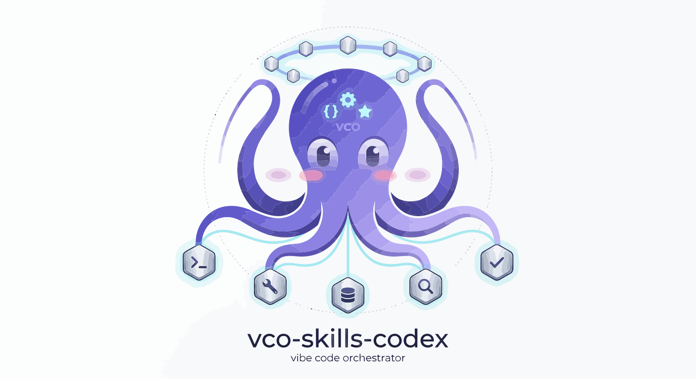

[English](./README.en.md)

# VibeSkills

> 🐙 一个把多个上游项目、数百个 skills、MCP 入口、插件能力和治理规则整合进同一运行时的 AI 能力栈。

VibeSkills 是这个仓库对外展示的名字，背后的运行时核心是 VCO。它不是单点工具，也不是只会“补代码”的技能集合，而是一套已经完成整合和治理的能力系统：目前沉淀了 340 个可直接调用的 skills 模块，吸收和借鉴了 19 个高价值上游项目与实践来源，并通过 129 条基于配置的策略、契约与规则，把 skills、MCP、插件、工作流和验证机制收进同一套可治理运行时。

  🧠 规划 · 🛠️ 工程 · 🤖 AI · 🔬 科研 · 🧬 生命科学 · 🎨 可视化 · 🎬 多媒体

## ✦ 这个仓库一开始就能帮你做什么

如果把这 340 个 skills 按“真实工作”而不是按“仓库目录”来看，VibeSkills 已经覆盖了从需求理解、方案设计、编码实现、测试验证，到文档沉淀、数据分析、科研支持、生命科学工具链和多媒体生成的一整条能力链。下面这张表是按用户视角整理的能力地图。

| 能力域 | 能覆盖的具体工作 | 代表 skills / 系统 | 典型结果 |
| --- | --- | --- | --- |
| 需求洞察与问题澄清 | 把模糊想法、口头需求、零散目标整理成边界清晰的问题定义，明确目标、约束、验收标准、风险点和优先级 | brainstorming、create-plan、speckit-clarify、aios-analyst、aios-pm | 需求澄清文档、问题定义、范围边界、目标说明 |
| 产品规划与任务拆解 | 把一个想法继续拆成 spec、plan、tasks、里程碑、依赖关系、交付顺序和执行清单 | writing-plans、speckit-specify、speckit-plan、speckit-tasks、aios-po、aios-sm、OpenSpec 相关流程 | PRD、规格文档、计划文档、任务分解、执行路线 |
| 架构设计与技术选型 | 设计前后端、全栈、数据层、接口层、部署层的整体结构，比较技术路线并给出约束下的取舍方案 | aios-architect、architecture-patterns、context-fundamentals、aios-master | 架构方案、模块边界、接口设计、技术选型结论 |
| 软件开发与代码实现 | 新功能开发、旧功能改造、脚手架搭建、工程化接入、自动化实现、跨文件修改和端到端落地 | aios-dev、autonomous-builder、aios-master、speckit-implement | 可运行代码、模块实现、脚手架、集成结果 |
| 调试、修复与重构 | 定位报错、分析根因、修复行为错误、清理 AI 生成的冗余代码、重构不稳定结构、恢复可维护性 | error-resolver、debugging-strategies、systematic-debugging、deslop、build-error-resolver | 修复补丁、根因分析、重构结果、问题回放记录 |
| 测试设计与质量保证 | 设计测试策略、单元测试、属性测试、回归测试、质量门禁、验收验证和完成前核查 | tdd-guide、test-driven-development、aios-qa、code-review、code-reviewer、verification-before-completion、property-based-testing、hypothesis-testing | 测试用例、验证记录、质量结论、验收清单 |
| 代码评审与工程规范 | 做代码审查、风险检查、性能与安全审阅、可维护性评估，并把 review 结果转成可执行改进项 | reviewing-code、code-review-excellence、security-reviewer、receiving-code-review、requesting-code-review | review 意见、风险清单、修改建议、质量审计结论 |
| GitHub、仓库协作与发布 | 管理 issue / PR、修复 CI、处理 review comment、创建发布分支、部署站点、维护协作流程 | aios-devops、gh-fix-ci、gh-address-comments、github_*、workflow_*、vercel-deploy、netlify-deploy、yeet | Issue、PR、CI 修复、发布记录、部署结果 |
| 受管工作流与多 Agent 协作 | 在任务执行前冻结需求、编排步骤、分派任务、留存阶段记录，并在完成后做 cleanup 和验证闭环 | vibe、swarm_*、task_*、agent_*、hive-mind-advanced、local-vco-roles、superclaude-framework-compat | 受管执行日志、任务状态、协作记录、阶段收口凭据 |
| Skills 激活与能力路由 | 解决“能力很多但触发不到”的问题，在正确阶段拉起正确 skill、MCP、插件和规则，而不是让能力长期沉睡 | vibe、deepagent-toolchain-plan、hooks_route、hooks_worker-detect、semantic-router、VCO 路由治理 | 路由结果、激活链路、自动分派、能力命中记录 |
| MCP 接入与外部系统集成 | 把浏览器、设计稿、搜索、抓取、第三方服务、插件能力和外部上下文接入统一运行时 | mcp-integration、playwright、scrapling、browser_*、figma、figma-implement-design、transfer_* | MCP 配置、浏览器自动化流程、抓取结果、外部集成方案 |
| 文档写作与知识沉淀 | 编写 README、技术文档、操作手册、规范说明、Mermaid 图、知识库条目和长文档 | docs-write、docs-review、markdown-mermaid-writing、knowledge-steward、writing-docs、scientific-reporting | README、技术文档、流程图、知识记录、报告 |
| 办公文档与文件处理 | 处理 Word、PDF、Excel、CSV、Markdown 转换、批注回复、文件整理、格式保留和资料归档 | docx、pdf、xlsx、spreadsheet、markitdown、excel-analysis、file-organizer、docx-comment-reply | 文档改写结果、表格分析、格式转换、归档方案 |
| 数据分析与统计建模 | 做 EDA、回归分析、假设检验、可视化、数据清洗、指标计算、分布分析和统计报告 | data-exploration-visualization、statistical-analysis、statsmodels、scikit-learn、polars、dask、xan | 分析报告、统计结果、建模基线、数据处理流程 |
| 机器学习与 AI 工程 | 不只是训练模型，还覆盖从数据准备、特征工程、训练评估、解释分析，到 embedding、RAG、检索链路和实验管理的一整套 AI 工程闭环 | senior-ml-engineer、training-machine-learning-models、evaluating-machine-learning-models、shap、embedding-strategies、similarity-search-patterns、weights-and-biases | 模型方案、评估指标、解释结果、检索系统、实验记录 |
| 可视化与展示表达 | 生成图表、交互可视化、科研图、演示文稿、网页化展示材料和面向传播的可视表达 | plotly、matplotlib、seaborn、datavis、creating-data-visualizations、scientific-slides、paper-2-web、infographics | 图表、可视化页面、Slides、信息图、展示型网页 |
| 科研检索与学术写作 | 覆盖从文献检索、证据梳理、引用管理，到综述撰写、论文成稿、投稿准备、审稿回复的完整科研写作链路 | research-lookup、literature-review、citation-management、scientific-writing、scholarly-publishing、peer-review、submission-checklist | literature review、引用库、论文草稿、投稿文档、审稿意见 |
| 生命科学与生物医药 | 这不是“顺手支持一点科研”，而是已经深入到生物信息学、单细胞、蛋白质、药物发现、临床数据、科研数据库和实验平台接入的专业工作面 | biopython、scanpy、scvi-tools、alphafold-database、uniprot-database、clinicaltrials-database、drugbank-database、benchling-integration、opentargets-database | 生信分析流程、数据库结果、实验设计支持、科研辅助文档 |
| 数学、优化与科学计算 | 进行符号推导、贝叶斯建模、多目标优化、仿真计算、量子计算、数值分析和复杂科学计算 | math-tools、sympy、pymc-bayesian-modeling、pymoo、fluidsim、qiskit、cirq、qutip | 推导结果、建模代码、优化方案、仿真结果 |
| 图像、音频、视频与内容生产 | 生成图片、信息图、语音、字幕、视频、转写内容和面向社媒或展示的多媒体素材 | generate-image、imagegen、speech、transcribe、video-studio、infographics | 图片、音频、字幕、视频成品、传播素材 |

上面这张表不是把 340 个 skills 机械地铺开，而是把仓库已经具备的能力，按“一个团队实际会把 AI 用在哪些工作上”重新整理了一遍。也就是说，这个仓库并不只服务于写代码，它已经覆盖了从需求到交付、从工程到研究、从自动化到文档、从数据到生命科学的一整套实际工作面。

## 🧭 如果把这 20 个能力域再往下拆

上面的总表适合先快速扫一遍。如果再往下拆，你会发现这个仓库覆盖的不是几个抽象大词，而是一整套更细的工作切面。下面按几个更大的工作簇继续展开。

### 🧩 规划、架构与工程实现

| 能力域 | 进一步拆开的子领域 | 进一步覆盖的工作 |
| --- | --- | --- |
| 需求洞察与问题澄清 | 需求访谈、问题定义、边界识别、约束收集、成功标准、风险预判 | 把“我大概想做一个东西”整理成可以执行的问题陈述，补齐目标、非目标、输入输出边界和验收口径 |
| 产品规划与任务拆解 | spec、plan、tasks、里程碑、依赖关系、优先级、交付顺序 | 把一个大想法拆成可以安排、可以跟踪、可以逐步交付的计划，而不是一口气黑盒式开做 |
| 架构设计与技术选型 | 前端结构、后端边界、接口设计、数据层、部署层、模式选择、技术比较 | 评估该用什么结构、哪些模块该解耦、哪些组件该收敛，减少后面返工和架构漂移 |
| 软件开发与代码实现 | 新功能开发、脚手架搭建、跨文件修改、模块整合、工程化落地、自动化实现 | 从需求进入代码，把方案真正落地成可运行实现，而不是停留在计划和说明层 |
| 调试、修复与重构 | 报错定位、根因分析、行为修复、冗余清理、结构重构、可维护性恢复 | 不只修表面报错，也处理代码为什么会变脆、为什么难维护、为什么 AI 容易越修越乱 |
| 测试设计与质量保证 | 单元测试、属性测试、回归验证、验收检查、质量门禁、完成前核对 | 让“改完看起来能跑”升级成“有证据证明没破坏已有行为” |
| 代码评审与工程规范 | review、风险检查、可维护性评估、安全审阅、性能提示、修改建议 | 把代码从“勉强可用”往“长期可接手、可迭代、可协作”推进 |

### 🔗 协作治理、路由与外部能力接入

| 能力域 | 进一步拆开的子领域 | 进一步覆盖的工作 |
| --- | --- | --- |
| GitHub、仓库协作与发布 | issue / PR 流程、CI 修复、review comment 处理、发布分支、部署记录、上线动作 | 覆盖从日常仓库协作到发布收口的整条链路，不把交付停在本地工作区 |
| 受管工作流与多 Agent 协作 | 需求冻结、阶段执行、任务分派、阶段留痕、proof、cleanup、多 agent 协同 | 让复杂任务不是“模型自己发挥”，而是在可追踪、可验证、可收口的治理框架里完成 |
| Skills 激活与能力路由 | 规则路由、语义路由、阶段触发、能力编排、沉睡能力唤起、执行面命中 | 解决“仓库里有很多能力，但真正任务里用不上”的问题，让能力在正确时机进入执行链路 |
| MCP 接入与外部系统集成 | 浏览器自动化、网页抓取、设计稿到代码、第三方服务接入、插件入口、外部上下文获取 | 把网页、服务、设计、自动化脚本和外部系统接进同一运行时，而不是让人手动切换一堆工具 |
| 文档写作与知识沉淀 | README、技术说明、操作手册、规范文档、Mermaid 图、知识条目、报告 | 让项目结果不是“只存在聊天记录里”，而是能沉淀成团队可继续使用的文档资产 |
| 办公文档与文件处理 | Word、PDF、Excel、CSV、Markdown 转换、批注回复、格式保留、资料整理 | 覆盖很多真实工作里最耗时间但最容易被忽略的办公文件处理场景 |

### 🔬 数据、AI、科研与专业领域能力

| 能力域 | 进一步拆开的子领域 | 进一步覆盖的工作 |
| --- | --- | --- |
| 数据分析与统计建模 | EDA、回归分析、假设检验、指标体系、清洗转换、分布分析、统计报告 | 把原始数据整理成分析结论，不只是出图，而是形成可解释的统计判断 |
| 机器学习与 AI 工程 | 模型训练、模型评估、特征工程、解释性分析、embedding、RAG、实验跟踪、工作流规范化 | 这块的优势不只是“会调模型”，而是把 AI 工程真正需要的训练、评估、解释、检索和实验闭环放进同一个受管体系里 |
| 科研检索与学术写作 | 文献搜索、综述整理、引用管理、论文写作、投稿准备、审稿回复、学术规范 | 这块的强点在于链路完整，不只是帮你找论文，而是能一路支撑到综述、成稿、投稿和回复审稿意见 |
| 生命科学与生物医药 | 生物信息学、单细胞分析、蛋白质结构、药物发现、临床试验数据、科研数据库、实验平台接入 | 这块是仓库非常有辨识度的能力区，因为它已经深入到专业科研与生物医药流程，而不是停留在泛 AI 层面的浅覆盖 |
| 数学、优化与科学计算 | 符号推导、贝叶斯建模、多目标优化、仿真计算、量子计算、科学建模 | 适合需要精确计算、复杂推导和学术级建模的场景，不局限于常规软件工程问题 |

### 🎨 可视化、展示与内容生产

| 能力域 | 进一步拆开的子领域 | 进一步覆盖的工作 |
| --- | --- | --- |
| 可视化与展示表达 | 图表生成、交互可视化、科研图、演示文稿、网页展示、信息表达设计 | 把分析或项目结果做成可读、可展示、可传播的可视成果，而不是只停留在原始输出 |
| 图像、音频、视频与内容生产 | 图片生成、信息图、语音合成、转写字幕、视频生产、多媒体素材整理 | 支持从静态视觉到音视频内容的整套生成与加工流程，适合展示、传播和内容制作场景 |

如果把这些子领域再往前串起来看，这个仓库覆盖的其实是一条完整工作流：先理解需求，再做规划，再决定架构，再进入实现、验证、协作、发布，之后还能继续延伸到文档沉淀、数据与 AI、科研分析、生命科学、可视化表达和多媒体生产。也正因为覆盖面已经这么宽，它才更需要路由、治理和规范化，而不是只靠“skills 数量很多”来支撑。

其中最能拉开差异的，其实就是 AI 工程、科研写作和生命科学这三块。很多仓库也会提到“支持机器学习”或“支持研究”，但更多只是停留在若干散点工具上；这里更不一样的地方在于，这三块已经被做成了可以衔接上下游的工作链。它不只是会调用几个模型、查几篇论文、连几个数据库，而是能把训练评估、研究检索、学术写作、生物医药分析和实验平台接入放进同一个受管运行时里，这也是这个仓库相比普通 skills 仓库更有辨识度的地方。

## 📦 我们已经整合了哪些资源

这个仓库不是从零自造一切，而是在持续吸收成熟项目已经跑通的方法、结构和工作流。当前已经整合了 19 个高价值上游项目与实践来源，并把它们放进同一套治理体系里统一调度。

| 资源类型 | 当前沉淀 | 意义 |
| --- | --- | --- |
| Skills 与能力模块 | 340 个可直接调用的 skills / 能力模块 | 覆盖从需求、规划、编码、验证到文档、数据、科研和多媒体生成的完整工作链 |
| MCP / 插件 / 浏览器入口 | 多类外部工具接入能力 | 让外部服务、网页、设计稿、检索结果和自动化流程进入同一运行时 |
| 上游项目与方法来源 | 19 个高价值项目与实践来源 | 把成熟项目的长处吸收进统一系统，而不是让用户自己手动拼装 |
| 治理规则与契约 | 129 条基于配置的策略、契约与规则 | 约束澄清、规划、执行、验证、留痕、清理和回退，让系统长期可维护 |

项目持续整合并治理 superpower、claude-scientific-skills、get-shit-done、aios-core、OpenSpec、ralph-claude-code、SuperClaude_Framework 等优秀项目，把它们在提示组织、技能沉淀、计划驱动、治理执行、科研辅助和工程协作上的优势吸收进同一套系统里。

这也是 VibeSkills 和普通“提示词合集”或“技能目录仓库”的根本区别：这里展示的不是静态条目，而是一张已经完成整合、可被路由、可被治理、可被验证的能力网络。

  

## ✨ 为什么它会让人立刻感到不一样

很多 skills 仓库其实只是在回答一个问题：这里有什么能力？

VibeSkills 更在意的是另外几个问题：

- 现在该调用什么，而不是让你自己翻完整个技能表
- 应该先做什么，而不是让 AI 直接跳进执行
- 哪些能力可以安全组合，哪些地方必须设边界
- 完成之后怎么验证、怎么留痕、怎么避免长期黑盒化

它不是把能力堆得更多。
它是在把“调用、治理、验证、回看”整合成一个真正能工作的系统。

## ⚠️ 它真正解决的痛点

如果你已经在重度使用 AI，大概率已经遇到过这些问题：

- skills 太多，不知道当前场景到底该用哪个
- skills 激活率低，仓库里明明有很多能力，但真实任务里经常触发不到、想不起来、接不上流程
- 项目、插件、工作流互相重叠，也互相冲突
- AI 没澄清需求就直接开做，速度很快，方向却不稳
- 做完之后没有验证、没有证据、没有回退面
- 随着使用变深，整个工作流越来越像一个没人说得清的黑盒

VibeSkills 不是假装这些问题不存在。
它的价值就在于正面处理这些问题。

VCO 生态也在解决一个很现实的问题：不是 skills 不够多，而是很多 skills 长期处在“沉睡”状态，真实任务里激活率太低。通过路由判断、MCP / 插件入口、工作流节点编排和治理规则，系统会尽量让合适的能力在合适的阶段被真正拉起，而不是一直躺在仓库里。

## ⚙️ 它是怎么工作的

你可以把它理解成三层：

### 1. 🧠 智能路由

在合适的场景下，AI 不需要你显式记住“这次该调用哪个 skill”。

VibeSkills 会把逻辑路由和 AI 智能路由结合起来，尽量把合适的能力放到合适的场景里，让调用更自然，而不是靠你手动背技能表。VCO 生态要解决的也包括 skills 激活率低的问题，让更多能力在正确上下文和正确阶段进入执行面，而不是长期无法被真正使用。

### 2. 🧭 受管工作流

它不只是在“调工具”。
它更关心工作怎么做才稳定。

所以这套系统会尽量把需求澄清、确认、执行、验证、回顾、留痕这些步骤收进统一流程里，避免 AI 一上来就黑盒式开跑。

### 3. 🧩 整合能力

这里不只有 skills。

还有插件、项目、工作流设计、AI 规范、安全边界、长期维护经验，以及我自己在实践里踩过的坑。
VCO 负责把这些能力组织成一个更统一的运行时，而不是让它们继续散落在不同角落里。

## 👥 它适合谁

VibeSkills 主要适合这几类人：

- 想让 AI 更稳定地帮自己做事的普通用户
- 已经在重度使用 AI / Agent / 自动化的进阶用户
- 想把 AI 工作流做得更规范、更可维护的个人或小团队
- 已经厌倦“技能太多但不好用”的人

如果你只是想找一个单点工具，这个仓库可能不是最轻的选择。
如果你想把 AI 用得更稳、更顺、更长期，它会更有意义。

## 🚀 开始了解它

如果你想先快速理解这套系统，再决定走哪条路径：

- [`docs/quick-start.md`](./docs/quick-start.md)
- [`docs/manifesto.md`](./docs/manifesto.md)

如果你已经准备开始安装，再进入一步式安装入口：

- [`docs/install/one-click-install-release-copy.md`](./docs/install/one-click-install-release-copy.md)

如果你已经是重度用户，想进一步看更完整的安装与路径说明：

- [`docs/install/recommended-full-path.md`](./docs/install/recommended-full-path.md)
- [`docs/cold-start-install-paths.md`](./docs/cold-start-install-paths.md)

## 📐 项目理念

VibeSkills 的核心要义是规范化。只有先把需求澄清、任务计划、执行、验证、留痕和回退做成可复用的秩序，人类对 AI 的描述才会更清晰，AI 的执行才会更稳定，后续维护与整体技术债才会维持在更低水平。

这个项目想做的，不是让 AI 看起来更聪明，而是让用户主要负责表达目标，后续任务在规范化工作流中被持续地落地、验证和维护，最终把真实工作里最容易失控的部分变成一个更可调用、更可治理、也更可长期维护的系统。
