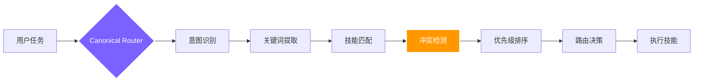

<div align="right">
  <a href="./README.en.md">🇬🇧 English</a> &nbsp;|&nbsp; <b>🇨🇳 中文</b>
</div>

<br/>

<div align="center">

<a href="https://github.com/foryourhealth111-pixel/Vibe-Skills">
  
</a>

<br/>


<br/><br/>

### 不只是技能集合，更是你的**个人 AI 操作系统**

集成数百个 Skills、MCP 入口与治理规则的工业级运行时框架

<br/>

<a href="https://github.com/foryourhealth111-pixel/Vibe-Skills/stargazers">
  
</a>
<a href="https://github.com/foryourhealth111-pixel/Vibe-Skills/network/members">
  
</a>
<a href="https://github.com/foryourhealth111-pixel/Vibe-Skills/pulse">
  
</a>
<a href="https://gitcgr.com/foryourhealth111-pixel/Vibe-Skills">
  
</a>

<br/><br/>


&nbsp;

&nbsp;


<br/><br/>

🧠 规划 · 🛠️ 工程 · 🤖 AI · 🔬 科研 · 🎨 创作

<br/>

<a href="./docs/install/one-click-install-release-copy.md">
  
</a>
&nbsp;
<a href="./docs/quick-start.md">
  
</a>
&nbsp;
<a href="./README.en.md">
  
</a>

<br/><br/>

<kbd>安装</kbd> &nbsp;→&nbsp;
<kbd>/vibe 或 $vibe</kbd> &nbsp;→&nbsp;
<kbd>智能路由</kbd> &nbsp;→&nbsp;
<kbd>M / L / XL 执行</kbd> &nbsp;→&nbsp;
<kbd>治理验证</kbd> &nbsp;→&nbsp;
<kbd>✅ 交付</kbd>

</div>

## 📋 目录

- [为什么与众不同](#-为什么它与众不同)
- [适合你吗](#-适用人群)
- [智能路由](#-智能路由机制340-技能如何协同而不冲突)
- [记忆机制](#-记忆机制让-ai-真正记住你的一切)
- [全景能力地图](#-全景能力地图你的全能工作台)
- [开始使用](#-开启你的-vibe-体验)

> [!IMPORTANT]
> ### 🎯 核心愿景
>
> Vibe Skills 将与时俱进——保证好用、持续提升效率，同时**大幅降低前沿 vibecoding 技术的学习门槛**，消解面对新技术的认知焦虑。
>
> **无论你是否具备编程基础，都能以极低门槛直接调用当今最前沿的 AI 技术集合。**
> 让每个人都能享受 AI 带来的生产力飞跃。

<br/>

---


## ✨ 为什么它与众不同？

> 传统的 Skills 仓库在回答：_"我这里有什么工具？"_
> **VibeSkills 正面迎击的是重度 AI 用户的核心痛点：_"我该怎么稳定地完成工作？"_**

<br/>

<div align="center">

| ❌ &nbsp;传统痛点（你可能经历过）| ✅ &nbsp;VibeSkills 解法（我们正在做）|
|:---|:---|
| **技能沉睡**：仓库里几百个能力，真实场景下 AI 根本想不起来用，激活率极低。| **🧠 智能路由**：该调什么，系统根据上下文自动路由拉起，无需你翻背技能表。|
| **黑盒狂奔**：AI 不澄清需求就直接开做，速度快但方向偏，项目逐渐变成黑盒。| **🧭 受管工作流**：澄清 → 验证 → 留痕被严格收进统一流程，每步可溯源。|
| **互相冲突**：不同插件和工作流之间缺乏统筹，导致环境污染或死循环。| **🧩 全局治理**：129 条契约规则设定安全边界与回退机制，保障长期稳定性。|
| **工作区脏乱差**：工作久了仓库混乱，新 Agent 接手时遗漏项目细节，衔接断层。| **📁 文件目录语义治理**：固定化架构存储文件，让新对话的 AI 立刻理解上下文。|
| **AI 小毛病频发**：删备份时把主文件删了；写了一堆静默兜底，自信满满说"做好了"。| **🛡️ 内置防护规则**：禁止批量删除文件（只能逐个操作）；强制显式警告用户兜底行为。|
| **用户自行规范工作流**：需要靠经验手动维护与 AI 的协作流程，学习成本高。| **🚦 框架引导全程**：需求沟通 → 计划确认 → 多代理并发执行 → 自动测试迭代，全程托管。|
| **多代理并发时技能分发混乱**：处理多种任务时，不好指定分发对应技能。| **🤖 自动技能分发**：多代理工作流自动为每个 Agent 分配任务对应的 Skills。|

</div>

<br/>

---


## 👥 适用人群

_这些痛点，你中了几条？找准自己的位置，接下来的系统设计才真正有意义。_

<details>
<summary>适合你吗？点击展开</summary>

<br/>

<div align="center">

| 人群 | 描述 |
|:---:|:---|
| 🎯 **追求稳定交付的普通用户** | 想让 AI 成为可靠的帮手，而不是脱缰的野马 |
| ⚡ **重度依赖 AI/Agent 的进阶极客** | 需要一个能承载庞大工作流的统一底座 |
| 🏢 **规范化要求高的小型团队** | 希望把 AI 工作流变得更具可维护性和传承性 |
| 😩 **被"技能堆砌"折磨的实践者** | 已厌倦找工具，只想要一套开箱即用的解决方案 |

</div>

> _如果你只想找个单一的小脚本，它可能过于庞大；但如果你想把 AI 用得更稳、更顺、更长远，它将是你不可或缺的利器。_

</details>

<br/>

---


## 🔀 智能路由机制：340+ 技能如何协同而不冲突

_确认了这是给你的之后，下一个问题：340+ 技能并存，系统怎么不乱？_

面对 340+ 技能，你可能会担心：_"这么多相似的技能，会不会互相打架？系统怎么知道该用哪个？"_

### 路由如何工作

VibeSkills 使用 **Canonical Router（权威路由器）** 作为唯一的路由决策中心：



VibeSkills 遵循 `澄清 ➔ 规划 ➔ 执行 ➔ 验证` 的受管工作流，确保每个任务都经过完整的质量把控：

- **需求澄清**：通过 `speckit-clarify` 等技能明确边界和验收标准
- **架构规划**：使用 `aios-architect` 等技能设计实现路径
- **执行层**：340+ 技能按需调用，完成具体工作
- **质量验证**：通过 `tdd-guide`、`code-review` 等技能确保交付质量

> [!TIP]
> **内置 CRON 支持**：只需在请求中显式启用，即可让 vibe 按计划持续推进任务。
> ```
> 我希望基于 cron 持续推进 XXX 任务，完成：XXXX $vibe
> ```

---

### M / L / XL 执行级别

路由器在选择主技能后，还会根据任务复杂度自动判断执行级别：

<div align="center">

| 级别 | 适用场景 | 特点 |
|:---:|:---|:---|
| **M** | 窄范围执行，边界清楚的小范围工作 | 单代理，省 token，响应快 |
| **L** | 中等复杂任务，需要设计、计划与评审 | 多阶段，克制，可控 |
| **XL** | 大任务，可并行、长流程、多代理分波推进 | 自动分发对应 Skills，并行度高 |

</div>

> 系统会在需求澄清之后、计划执行之前，自动选择级别。用户只需调用 `/vibe` 或 `$vibe`。
>
> 你也可以显式表达偏好：
> ```text
> 我希望你按照计划执行这个任务，启动 XL 级工作流 /vibe
> ```

---

<details>
<summary><b>🔍 路由机制详解与常见问题（点击展开）</b></summary>

<br/>

**为什么要这样设计？**

传统技能仓库让 AI"自由选择"，结果是 ❌ AI 记不住有哪些技能 ❌ 相似技能互相冲突 ❌ 执行路径不可预测。

VibeSkills 确保：✅ **确定性**（相同任务走相同路由）· ✅ **可追溯**（每次决策有明确理由）· ✅ **可控性**（`/vibe` 可覆盖默认路由）· ✅ **稳定性**（129 条治理规则防冲突）

<br/>

**一次路由一个还是多个？**

核心原则：一次任务通常路由到一个主技能，但该技能可以调用其他技能作为子流程。

- **单一主路由**：Canonical Router 会选择**一个最匹配的主技能**
- **技能组合**：主技能在执行过程中，可按需调用其他技能（如 `vibe` 可调用 `speckit-clarify`、`aios-architect` 等）
- **受管协同**：多个技能的协同由治理规则控制，而不是随意组合

<br/>

**相似技能的冲突如何处理？**

当多个技能看起来都能完成任务时，路由器通过以下机制避免冲突：

1. **优先级规则**：每个技能都有明确的优先级和适用场景
2. **上下文匹配**：分析任务复杂度、是否需要多阶段、用户显式偏好
3. **互斥规则**：129 条规则中包含互斥规则，防止冲突组合
4. **降级和回退**：首选技能不可用时按优先级尝试备选，不会陷入死循环

<br/>

**会因为选项过多导致 token 爆炸吗？**

不会。路由不是把所有选项抛给模型，而是采用智能触发机制：

```
用户命令 → AI 辅助治理发掘意图关键词 → 关键词触发技能路由
```

治理框架下有约 30k 的初始上下文消耗，但不会导致 token 爆炸。

<br/>

**实际例子：用户说"帮我重构这个项目"**

1. 意图识别 → 复杂重构任务
2. 关键词提取 → 重构、项目、代码质量
3. 技能匹配 → `vibe` / `autonomous-builder` / `systematic-debugging`
4. 路由决策 → 选择 `vibe`（重构需要多阶段：需求澄清 → 计划制定 → 分阶段执行 → 验证测试）

</details>

<br/>

---


## 🧠 记忆机制：让 AI 真正"记住"你的一切

_路由解决了「用哪个技能」。但有一个更根本的问题：对话结束后，AI 记得你吗？_

你是否遇到过这些情况？

<div align="center">

| ❌ 痛点场景 | ✅ VibeSkills 的解法 | 负责组件 |
|:---|:---|:---:|
| 每次新对话都要从头解释项目背景 | 架构决策、技术规范永久归档，新会话自动载入 | `Serena` |
| AI 踩过的坑下次还会踩，灵感随上下文消失 | 一句话存入 Obsidian + GitHub，知识永久沉淀 | `knowledge-steward` |
| 长任务中 AI 逐渐"忘记"早期上下文 | 会话内语义向量缓存，毫秒级找回相关片段 | `ruflo` |
| 跨项目知识无法积累复用 | 实体关系图谱跨会话积累，越用越聪明 | `Cognee` |
| 长任务中断后难以衔接给新 Agent | 自动折叠为工作记忆 + 工具记忆 + 证据锚点 | `deepagent-memory-fold` |

</div>

<br/>

<details>
<summary><b>📐 展开：四层记忆架构详解、技能说明与治理规则</b></summary>

<br/>

VibeSkills 构建了**四层记忆体系**，每种记忆需求有且只有一个负责组件：

| 层级 | 组件 | 作用域 | 核心用途 |
|:---:|:---:|:---:|:---|
| **L1 会话层** | `state_store` | 当前会话 | 执行进度、中间结果、临时状态——永远在线的"工作台" |
| **L2 项目层** | `Serena` | 当前项目 | 架构决策、技术规范、项目约定——只写入经用户明确确认的决策 |
| **L3 短期语义层** | `ruflo` | 会话内语义检索 | 向量缓存，让 Agent 在单次长任务中快速找回相关上下文片段 |
| **L4 长期图谱层** | `Cognee` | 跨会话 | 实体关联、关系图谱、长周期知识积累——AI 的"长期记忆" |

> **可选外部扩展**：`mem0` 可作为个人偏好后端（输出风格、重复约束），以 opt-in 方式软接入；`Letta` 提供记忆块映射与 Token 压力策略——两者均不替代上述四层的权威地位。

<br/>

**三个专属记忆技能**

| 技能 | 定位 | 触发方式 |
|:---:|:---|:---|
| `knowledge-steward` | **知识管家**：一句话把对话中的灵感、踩坑、有效 Prompt 永久存入 Obsidian + GitHub | "保存这个提示词" / "记录这个 Bug" / "save this insight" |
| `digital-brain` | **数字大脑**：结构化个人知识库，管理身份定位、内容创作、人脉网络、项目复盘 | 主动调用，适合建立个人知识操作系统 |
| `deepagent-memory-fold` | **上下文折叠**：长任务运行中自动将庞大上下文压缩为结构化的工作 + 工具 + 证据记忆 | 长任务 context 临近上限时自动或手动触发 |

<br/>

**治理规则**：单一权威源（无双轨竞争）· 显式写入（`Serena` 仅用户确认后写入）· `episodic-memory` 永久禁用 · `mem0` 只记录个人偏好（禁止路由决策/项目真相）· 任何外部后端均有 Kill Switch 一键降级

</details>


---


## ✦ 全景能力地图：你的全能工作台

_路由 + 记忆，构成了系统的调度神经。承载它们的，是这张端到端的能力版图——_

如果把这 340 个 skills 按"真实工作流"展开，VibeSkills 已经为你铺设好了一条**端到端的能力链**：

<br/>

<div align="center">

| 能力域 | 覆盖工作面 | 代表能力引擎 |
|:---|:---|:---|
| **💡 需求与澄清** | 拒绝黑盒开局：把模糊想法转为边界清晰、可验收的问题定义 | `brainstorming`, `speckit-clarify` |
| **📋 规划与拆解** | 将宏大目标拆解为 spec、plan、tasks、里程碑与执行流 | `writing-plans`, `speckit-specify`, `aios-po` |
| **🏗️ 架构与选型** | 设计前后端边界、接口、数据层、部署层与技术路线对比 | `aios-architect`, `architecture-patterns` |
| **💻 开发与实现** | 新功能开发、脚手架搭建、工程化集成和跨文件精准落地 | `autonomous-builder`, `speckit-implement` |
| **🔧 调试与重构** | 告别表面缝补：定位报错、分析根因、恢复项目级可维护性 | `error-resolver`, `systematic-debugging` |
| **🛡️ 测试与品控** | 单元测试、回归验证、质量门禁，实现"完成前强制核验" | `tdd-guide`, `aios-qa`, `code-review` |
| **🚀 协作与发布** | 接管 Issue/PR、CI 修复、Review 处理与自动化部署 | `aios-devops`, `gh-fix-ci`, `vercel-deploy` |
| **🤖 复合工作流** | 冻结需求、任务分派、多 Agent 协同、执行留痕与环境清理 | `vibe`, `swarm_*`, `hive-mind-advanced` |
| **🔌 外部生态接入** | 打通浏览器、网页抓取、设计稿、第三方服务与上下文记忆 | `mcp-integration`, `playwright`, `scrapling` |
| **📊 数据与 AI 工程** | EDA、清洗统计，到模型训练、RAG 检索与实验跟踪 | `senior-ml-engineer`, `statistical-analysis` |
| **🔬 科研与生命科学** | **强势领域**：文献综述、生信分析、单细胞、药物发现 | `literature-review`, `biopython`, `scanpy` |
| **📐 数学与专业计算** | 符号推导、贝叶斯建模、多目标优化、仿真乃至量子计算 | `sympy`, `pymc-bayesian-modeling`, `qiskit` |
| **🎨 多媒体与展示** | 交互图表、科研绘图、图片生成、语音合成与视频素材生产 | `plotly`, `generate-image`, `video-studio` |

</div>

<br/>

<details>
<summary><b>👉 点击展开：探索 VibeSkills 完整的 340+ 全栈能力矩阵详解</b></summary>

<br/>

> 💡 **治理的意义**：以下庞大的技能库不是孤立的脚本死水，而是一个被 VCO 运行时接管的生态。通过领域矩阵分类，系统会在正确的上下文节点自动唤起正确的工具，无需你手动遍历调用。

---

### 🧠 需求、规划与产品管理

> **让大想法变得可落地**：需求洞察、问题定义、Sprint 规划、任务切分与约束收集。确保在写下第一行代码前，方向清晰、边界明确且具有可验收的里程碑。

`.system`, `aios-pm`, `aios-po`, `aios-sm`, `aios-squad-creator`, `aios-ux-design-expert`, `brainstorming`, `create-plan`, `designing-experiments`, `planning-with-files`, `shared-templates`, `speckit-analyze`, `speckit-checklist`, `speckit-clarify`, `speckit-constitution`, `speckit-plan`, `speckit-specify`, `speckit-tasks`, `speckit-taskstoissues`, `subagent-driven-development`, `think-harder`, `treatment-plans`, `ux-researcher-designer`, `writing-plans`

---

### 🛠️ 软件工程与架构设计

> **真正的工程化构建底座**：从脚手架搭建、跨文件修改、API 接口设计到微服务架构评估。不仅产出代码，更负责上下文记忆、工具链编排与智能 Agent 的多阶段协同执行。

`aios-architect`, `aios-dev`, `aios-master`, `architecture-patterns`, `autonomous-builder`, `cancel-ralph`, `coding-tutor`, `context-fundamentals`, `context-hunter`, `cs-foundations`, `deepagent-memory-fold`, `deepagent-toolchain-plan`, `evaluating-code-models`, `get-available-resources`, `hive-mind-advanced`, `local-vco-roles`, `nowait-reasoning-optimizer`, `prompt-lookup`, `ralph-loop`, `skill-creator`, `skill-lookup`, `spec-kit-vibe-compat`, `speckit-implement`, `superclaude-framework-compat`, `theme-factory`, `vibe`, `webthinker-deep-research`

---

### 🔧 调试、测试与质量保证

> **守住代码和系统的生命线**：单元测试、根因分析、依赖冲突解决、安全漏洞审查与全套 TDD 测试驱动指南，确保系统告别"改完就崩"的黑盒状态。

`aios-qa`, `build-error-resolver`, `code-review`, `code-review-excellence`, `code-reviewer`, `data-quality-checker`, `data-quality-frameworks`, `debugging-strategies`, `deslop`, `detecting-performance-regressions`, `error-resolver`, `evals-context`, `experiment-failure-analysis`, `generating-test-reports`, `ml-data-leakage-guard`, `performance-testing`, `property-based-testing`, `providing-performance-optimization-advice`, `receiving-code-review`, `requesting-code-review`, `reviewing-code`, `security-best-practices`, `security-ownership-map`, `security-reviewer`, `security-threat-model`, `systematic-debugging`, `tdd-guide`, `verification-before-completion`, `verification-quality-assurance`, `windows-hook-debugging`

---

### 📊 数据分析与统计建模

> **让数据讲述事实**：从数据清洗、缺失值处理、探索性分析（EDA）到高级统计检验、回归模型、时序预测的一站式数据处理引擎。

`aios-data-engineer`, `anomaly-detector`, `correlation-analyzer`, `dask`, `data-artist`, `data-exploration-visualization`, `data-normalization-tool`, `detecting-data-anomalies`, `excel-analysis`, `exploratory-data-analysis`, `feature-importance-analyzer`, `geopandas`, `hypothesis-testing`, `metric-calculator`, `networkx`, `performing-causal-analysis`, `performing-regression-analysis`, `polars`, `preprocessing-data-with-automated-pipelines`, `regression-analysis-helper`, `running-clustering-algorithms`, `scientific-data-preprocessing`, `splitting-datasets`, `spreadsheet`, `statistical-analysis`, `statistics-math`, `statsmodels`, `usfiscaldata`, `vaex`, `xlsx`

---

### 🤖 机器学习与 AI 工程

> **全链路 AI 模型开发栈**：特征工程、模型训练、微调（Fine-tuning）、可解释性分析（SHAP）、大模型评估（Evals）与强化学习训练工作流。

`LQF_Machine_Learning_Expert_Guide`, `aeon`, `datamol`, `deepchem`, `embedding-strategies`, `engineering-features-for-machine-learning`, `evaluating-llms-harness`, `evaluating-machine-learning-models`, `explaining-machine-learning-models`, `geniml`, `ml-pipeline-workflow`, `openai-knowledge`, `pufferlib`, `pytorch-lightning`, `scikit-learn`, `scikit-survival`, `senior-computer-vision`, `senior-data-scientist`, `senior-ml-engineer`, `senior-prompt-engineer`, `shap`, `similarity-search-patterns`, `sparse-autoencoder-training`, `stable-baselines3`, `tensorboard`, `timesfm-forecasting`, `torch-geometric`, `torch_geometric`, `torchdrug`, `training-machine-learning-models`, `transformer-lens-interpretability`, `transformers`, `umap-learn`, `unsloth`, `weights-and-biases`

---

### 🧬 生命科学与生信计算

> **极其强悍的跨学科硬核利器**：单细胞测序分析、蛋白质结构折叠、药物分子发现、基因组学比对，并无缝对接各类云端生物实验室系统。

`adaptyv`, `alphafold-database`, `anndata`, `arboreto`, `benchling-integration`, `biopython`, `bioservices`, `cellxgene-census`, `cobrapy`, `deeptools`, `diffdock`, `dnanexus-integration`, `esm`, `etetoolkit`, `flowio`, `gene-database`, `gget`, `ginkgo-cloud-lab`, `gtars`, `histolab`, `imaging-data-commons`, `labarchive-integration`, `lamindb`, `latchbio-integration`, `matchms`, `medchem`, `molfeat`, `neurokit2`, `neuropixels-analysis`, `omero-integration`, `opentrons-integration`, `pathml`, `protocolsio-integration`, `pydeseq2`, `pydicom`, `pyhealth`, `pylabrobot`, `pyopenms`, `pysam`, `pytdc`, `rdkit`, `scanpy`, `scikit-bio`, `scvi-tools`, `tiledbvcf`

---

### 🔬 科学计算与数学逻辑

> **精确推导与复杂系统仿真**：符号数学演算、贝叶斯概率编程、量子计算模拟、多目标优化计算以及严格的命题逻辑与数理证明辅助。

`astropy`, `cirq`, `dialectic`, `fluidsim`, `gradient-methods`, `math`, `math-model-selector`, `math-tools`, `mathematical-logic-expert`, `matlab`, `pennylane`, `pymatgen`, `pymc`, `pymc-bayesian-modeling`, `pymoo`, `propositional-logic`, `qiskit`, `qutip`, `rowan`, `simpy`, `sympy`, `xan`

---

### 📚 科研文献与学术写作

> **学术生产力的高速公路**：横跨 PubMed/arXiv 等数十个科研数据库的精准检索、综述矩阵整理、引文管理，以及从论文起草、修改到同行评审的完整出版物流程。

`bgpt-paper-search`, `biorxiv-database`, `brenda-database`, `chembl-database`, `citation-management`, `clinical-decision-support`, `clinical-reports`, `clinicaltrials-database`, `clinpgx-database`, `clinvar-database`, `comprehensive-research-agent`, `content-research-writer`, `cosmic-database`, `datacommons-client`, `documentation-lookup`, `drugbank-database`, `ena-database`, `ensembl-database`, `fda-database`, `geo-database`, `gwas-database`, `hmdb-database`, `hypothesis-generation`, `kegg-database`, `literature-matrix`, `literature-review`, `manuscript-as-code`, `market-research-reports`, `metabolomics-workbench-database`, `open-notebook`, `openalex-database`, `opentargets-database`, `paper-2-web`, `pdb-database`, `peer-review`, `pubchem-database`, `pubmed-database`, `pyzotero`, `reactome-database`, `research-grants`, `research-lookup`, `scholar-evaluation`, `scholarly-publishing`, `scientific-brainstorming`, `scientific-critical-thinking`, `scientific-reporting`, `scientific-writing`, `string-database`, `submission-checklist`, `uniprot-database`, `uspto-database`, `zinc-database`

---

### 🎨 多媒体、可视化与文档

> **让知识与数据变得"可看见"**：交互式图表生成、科研出版级绘图、幻灯片生成、音视频生产，以及对 Word、PDF 等办公文档的深度读写与解析。

`algorithmic-art`, `creating-data-visualizations`, `data-storytelling`, `datavis`, `doc`, `docs-review`, `docs-write`, `document-skills`, `docx`, `docx-comment-reply`, `figma`, `figma-implement-design`, `file-organizer`, `g2-legend-expert`, `generate-image`, `imagegen`, `infographics`, `latex-posters`, `latex-submission-pipeline`, `markdown-mermaid-writing`, `markitdown`, `matplotlib`, `pdf`, `plotly`, `pptx-posters`, `report-generator`, `scientific-schematics`, `scientific-slides`, `scientific-visualization`, `screenshot`, `seaborn`, `slides-as-code`, `smart-file-writer`, `speech`, `structured-content-storage`, `transcribe`, `venue-templates`, `video-studio`, `visualization-best-practices`, `vscode-release-notes-writer`, `writing-docs`

---

### 🔌 外部集成、自动化与部署

> **打破运行时的局限**：通过 MCP 协议、Playwright 自动化框架无缝对接外部浏览器、设计平台与云端服务，并支持 CI/CD 流水线与一键自动化部署。

`aios-devops`, `alpha-vantage`, `claude-skills`, `commit-with-reflection`, `denario`, `digital-brain`, `edgartools`, `flashrag-evidence`, `fred-economic-data`, `geomaster`, `gh-address-comments`, `gh-fix-ci`, `hedgefundmonitor`, `hypogenic`, `iso-13485-certification`, `jupyter-notebook`, `knowledge-steward`, `mcp-integration`, `modal`, `modal-labs`, `netlify-deploy`, `openai-docs`, `perplexity-search`, `playwright`, `prowler-docs`, `scrapling`, `sentry`, `skypilot-multi-cloud-orchestration`, `vercel-deploy`

</details>

<br/>

---


## 📊 为什么说它强大？

_看完完整版图，来看实际数字。这不是演示项目，而是已经跑起来的系统：_

**VibeSkills** 背后的运行时核心是 **VCO**。它绝不仅仅是一个单点工具或只会"补代码"的脚本，而是一个已完成高度整合与治理的**超级能力网络**：

<br/>

<div align="center">

|                              🧩 技能模块                               |                            🌍 生态融合                            |                               ⚖️ 治理规则                                |
| :---------------------------------------------------------------------: | :---------------------------------------------------------------: | :----------------------------------------------------------------------: |
| <h2>340+</h2>可直接调用的 Skills<br/>覆盖从需求规划到执行的完整链路 | <h2>19+</h2>吸收高价值上游开源项目<br/>与最佳实践来源 | <h2>129 条</h2>基于配置的策略与契约<br/>确保执行稳定、可溯源、防发散 |

</div>

<br/>

---


## 📦 集众家之所长：资源整合

_这些能力不是凭空造出来的。VibeSkills 的底气，来自对开源社区最优解的持续整合与治理。_

我们深知，闭门造车无法适应飞速演进的 AI 时代。VibeSkills 的核心底气，来自于持续吸收开源社区最成熟的方法与架构，并将它们纳入同一套统一治理的调度系统中。

> 🙏 **特别鸣谢与致敬**
>
> 本项目持续整合、吸收并治理了以下优秀开源项目的核心优势：
>
> `superpower` · `claude-scientific-skills` · `get-shit-done` · `aios-core` · `OpenSpec` · `ralph-claude-code` · `SuperClaude_Framework` · `spec-kit` · `Agent-S` · `mem0` · `scrapling` · `claude-flow` · `serena` · `everything-claude-code` · `DeepAgent` 等等
>
> _感谢各位作者的无私奉献，没有这些璀璨的星光，就没有 VibeSkills 的诞生。在吸纳众多优秀仓库的过程中，我们已竭尽全力做好版权的分发与署名。若百密一疏出现纰漏，请在 Issue 中向我们提出，我们将第一时间进行修正与补充！_

<br/>

---


## 🚀 开启你的 Vibe 体验

_读到这里，你已经知道这是什么了。剩下的，一行提示词就够了：_

> ⚠️ **调用说明**：本项目采用 **Skills 格式架构**，请通过宿主环境的 Skills 调用方式唤起，**不要**将其作为独立命令行程序直接运行。

<br/>

<div align="center">

| 宿主环境 | 调用方式 | 示例 |
|:---:|:---:|:---|
| **Claude Code** | `/vibe` | `我希望你能设计一个 XXX /vibe` |
| **Codex** | `$vibe` | `我希望你设计一个 XXXX $vibe` |
| **Cursor / Windsurf** | Skills 入口 | 参考各平台 Skills 调用文档 |

</div>

<br/>

> 💡 **推荐做法**：如果你希望后续每一轮都明确继续处在 VibeSkills 治理流程里，就在每一轮继续显式带上 `$vibe` 或 `/vibe`。如果这一轮不显式写出调用语法，就不把它理解为"仍然被明确锁定在 vibe runtime 中"。

**当前公开支持面**：`codex`（最完整的 governed 路径）· `claude-code` · `cursor` · `windsurf`（已接入 runtime adapter）

<br/>

---

<details>
<summary><b>📚 文档导航与安装指引（点击展开）</b></summary>

<br/>

**快速了解系统**

- 📖 [了解系统架构与理念](./docs/quick-start.md)
- 📜 [VibeSkills 宣言](./docs/manifesto.md)

**安装与配置**

- ⚡️ [提示词安装（默认推荐）](./docs/install/one-click-install-release-copy.md)
- 🧩 [自定义工作流接入](./docs/install/custom-workflow-onboarding.md)
- 📁 [手动复制安装（离线）](./docs/install/manual-copy-install.md)
- 🛠 [高级 host / lane 参考](./docs/install/recommended-full-path.md)
- 🧊 [冷启动与其他环境说明](./docs/cold-start-install-paths.md)

</details>

<br/>

<div align="center">

### 🤝 加入社区 · 共建生态

欢迎来尝试和体验！有问题、有想法、有建议，欢迎随时提出——鄙人不才，一定认真听取和修改。

<br/>

**本项目完全开源，欢迎一切形式的贡献！**

无论是修复 bug、提升性能、添加新功能还是完善文档，你的每一个 PR 都弥足珍贵。

```
Fork → 修改 → Pull Request → 合并 ✅
```

<br/>

> ⭐ 如果这个项目对你有帮助，点个 **Star** 是对我最大的支持！
> 您的支持也是我这个核动力驴的浓缩 U-235 :blush:

<br/>

感谢 **LinuxDo** 各位佬的支持！

[](https://linux.do/)

各种技术交流、AI 前沿资讯、AI 经验分享，尽在 Linuxdo！

</div>

<br/>

---


## Star History

<a href="https://www.star-history.com/?repos=foryourhealth111-pixel%2FVibe-Skills&type=date&legend=top-left">
  <picture>
    <source media="(prefers-color-scheme: dark)" srcset="https://api.star-history.com/image?repos=foryourhealth111-pixel/Vibe-Skills&type=date&theme=dark&legend=top-left" />
    <source media="(prefers-color-scheme: light)" srcset="https://api.star-history.com/image?repos=foryourhealth111-pixel/Vibe-Skills&type=date&legend=top-left" />
    
  </picture>
</a>

<br/>

---

<div align="center">
  <p><i>把真实工作里最容易失控的部分，变成一个更可调用、更可治理、也更可长期维护的系统。</i></p>
  <br/>
  <sub>Made with ❤️ &nbsp;·&nbsp; <a href="https://github.com/foryourhealth111-pixel/Vibe-Skills">GitHub</a> &nbsp;·&nbsp; <a href="./README.en.md">English</a></sub>
</div>
