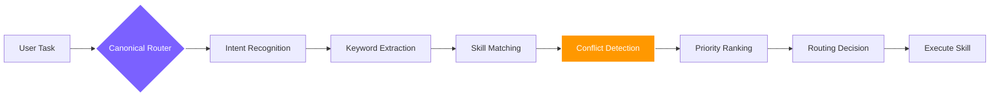

<div align="right">
  <b>🇬🇧 English</b> &nbsp;|&nbsp; <a href="./README.zh.md">🇨🇳 中文</a>
</div>

<br/>

<div align="center">

<a href="https://github.com/foryourhealth111-pixel/Vibe-Skills">
  
</a>

<br/>


<br/><br/>

### More than a skill collection — your **personal AI operating system**

If your AI supports skills, VibeSkills works. 340+ skills spanning coding, research, data science & creative work.

<br/>

<a href="https://github.com/foryourhealth111-pixel/Vibe-Skills/stargazers">
  
</a>
<a href="https://github.com/foryourhealth111-pixel/Vibe-Skills/network/members">
  
</a>
<a href="https://github.com/foryourhealth111-pixel/Vibe-Skills/pulse">
  
</a>
<a href="https://gitcgr.com/foryourhealth111-pixel/Vibe-Skills">
  
</a>

<br/><br/>


&nbsp;

&nbsp;


<br/><br/>

🧠 Planning · 🛠️ Engineering · 🤖 AI · 🔬 Research · 🎨 Creation

<br/>

<a href="https://github.com/foryourhealth111-pixel/Vibe-Skills/blob/main/docs/install/one-click-install-release-copy.en.md">
  
</a>
&nbsp;
<a href="https://github.com/foryourhealth111-pixel/Vibe-Skills/blob/main/docs/quick-start.en.md">
  
</a>
&nbsp;
<a href="./README.zh.md">
  
</a>

<br/><br/>

<kbd>Install</kbd> &nbsp;→&nbsp;
<kbd>/vibe or $vibe</kbd> &nbsp;→&nbsp;
<kbd>Smart Routing</kbd> &nbsp;→&nbsp;
<kbd>M / L / XL Execution</kbd> &nbsp;→&nbsp;
<kbd>Governance Verification</kbd> &nbsp;→&nbsp;
<kbd>✅ Delivery</kbd>

</div>

## 📋 Table of Contents

- [What makes it different](#-what-makes-it-different)
- [Who is it for](#-who-is-it-for)
- [Intelligent Routing](#-intelligent-routing-how-340-skills-collaborate-without-conflict)
- [Memory System](#-memory-system-ai-that-truly-remembers)
- [Full Capability Map](#-full-capability-map-your-all-in-one-workbench)
- [Installation & Management](#️-installation--skills-management)
- [Getting Started](#-getting-started)


<details>
<summary><b>🔑 New here? Quick glossary of key terms (click to expand)</b></summary>

<br/>

| Term | Plain-English Meaning |
|:---|:---|
| **VibeSkills / VCO** | This project. VCO = Vibe Code Orchestrator — the runtime engine behind the skills. |
| **Skill** | A focused capability module (e.g., `tdd-guide`, `code-review`). Think of skills as expert assistants the system calls on demand. |
| **Governed runtime** | When you invoke `/vibe`, the system follows a structured process — clarify → plan → execute → verify — instead of diving in blindly. |
| **Canonical Router** | The internal logic that decides which skill to activate for your task. Just invoke `/vibe` and let it route automatically. |
| **M / L / XL grade** | Task complexity level. M = quick focused task, L = multi-step task, XL = large task with parallel work. Automatically selected. |
| **Frozen requirement** | Once you confirm the plan, it is "frozen" — the system will not silently change scope mid-task. |
| **Root / Child lane** | In XL tasks, there is a "root" coordinator and "child" worker agents. Prevents conflicting outputs from parallel agents. |
| **Proof bundle** | Evidence that a task was actually completed correctly — test results, output, verification logs. |

</details>

> [!IMPORTANT]
> ### 🎯 Core Vision
>
> VibeSkills evolves with the times — ensuring it stays genuinely useful while **dramatically lowering the barrier to cutting-edge vibecoding technology**, eliminating the cognitive anxiety and steep learning curve that comes with new AI tools.
>
> **Whether or not you have a programming background, you can directly harness the most advanced AI capabilities with minimal effort.**
> Productivity gains from AI should be available to everyone.

<br/>

---


## ✨ What makes it different?

> Traditional skill repos answer: _"What tools do I have?"_
> **VibeSkills tackles the core pain point of heavy AI users: _"How do I manage and invoke large numbers of Skills, and get work done efficiently and reliably?"_**

<sub>Works with **Claude Code** · **Codex** · **Windsurf** · **OpenClaw** · **OpenCode** · **Cursor** and any AI environment that supports the Skills protocol. Native **MCP** compatibility.</sub>

<br/>

<div align="center">

| ❌ &nbsp;Traditional Pain Points (you've probably felt these) | ✅ &nbsp;VibeSkills Solutions (what we've built) |
|:---|:---|
| **Skills never activate**: Hundreds of capabilities in the repo, but AI rarely remembers to use them — activation rate is extremely low. | **🧠 Intelligent Routing**: The system automatically routes to the right skill based on context — no need to memorize a skill list. |
| **Blind execution**: AI dives in without clarifying requirements — fast but off-target, projects gradually become black boxes. | **🧭 Governed Workflow**: Clarify → Verify → Trace is enforced in a unified process; every step is auditable. |
| **Conflicting tools**: Lack of coordination between plugins and workflows leads to environment pollution or infinite loops. | **🧩 Global Governance**: 129 contract rules define safety boundaries and fallback mechanisms for long-term stability. |
| **Messy workspace**: After extended use, repos become cluttered; new Agents miss project details when taking over, causing handoff gaps. | **📁 Semantic Directory Governance**: Fixed-architecture file storage so any new AI conversation instantly understands the project context. |
| **AI bad habits**: Deletes main files while clearing backups; writes silent fallbacks then confidently claims "it's done". | **🛡️ Built-in Safety Rules**: Governed execution blocks dangerous bulk deletion and blind recursive wipes by default; fallback mechanisms must always show explicit warnings. |
| **Manual workflow discipline**: Users must maintain their own AI collaboration process from experience — high learning cost. | **🚦 Framework-guided end-to-end**: Requirements → Plan → Multi-agent execution → Automated test iteration — fully managed. |
| **Skill dispatch chaos in multi-agent runs**: Hard to assign the right skills to each agent for different tasks. | **🤖 Automatic Skill Dispatch**: Multi-agent workflows automatically assign the corresponding Skills to each Agent's task. |

</div>

<br/>

---


## 👥 Who is it for?

_Which of those pain points hit home? Find your position — what comes next will land harder._

<details>
<summary>Is this for you? Click to expand</summary>

<br/>

<div align="center">

| Audience | Description |
|:---:|:---|
| 🎯 **Users who need reliable delivery** | Want AI to be a dependable partner, not a runaway horse |
| ⚡ **Power users heavily relying on AI/Agents** | Need a unified foundation to support large-scale workflows |
| 🏢 **Small teams with high standardization needs** | Want AI workflows to be more maintainable and transferable |
| 😩 **Practitioners exhausted by skill sprawl** | Already tired of tool hunting — just want a ready-to-use solution |

</div>

> _If you're looking for a single small script, this may be overkill. But if you want to use AI more reliably, smoothly, and sustainably — this is your indispensable foundation._

</details>

<br/>

---


## 🔀 Intelligent Routing: How 340+ Skills Collaborate Without Conflict

_You know this is for you. Next question: 340+ skills in one system — how do they stay out of each other's way?_

With 340+ skills, you might wonder: _"Won't similar skills conflict? How does the system know which one to use?"_

### How routing works

VibeSkills uses a **Canonical Router** as the single authoritative routing decision center:



VibeSkills follows a `Clarify ➔ Plan ➔ Execute ➔ Verify` governed workflow to ensure every task goes through complete quality control:

- **Requirements Clarification**: Skills like `speckit-clarify` define clear boundaries and acceptance criteria
- **Architecture Planning**: Skills like `aios-architect` design the implementation path
- **Execution Layer**: 340+ skills called on demand to complete the actual work
- **Quality Verification**: Skills like `tdd-guide` and `code-review` ensure delivery quality

---

### Why this design?

Traditional skill repos let AI "freely choose" — the result:

- ❌ AI can't remember what skills exist
- ❌ Similar skills conflict with each other
- ❌ Execution paths are unpredictable

VibeSkills routing guarantees:

- ✅ **Determinism**: Same task always follows the same routing logic
- ✅ **Traceability**: Every routing decision has a clear rationale
- ✅ **Control**: Users can override default routing via explicit invocation (e.g. `/vibe`)
- ✅ **Stability**: 129 governance rules prevent conflicts and divergence

---

### M / L / XL Execution Levels

After selecting the primary skill, the router also automatically determines the execution level based on task complexity:

<div align="center">

| Level | Use Case | Characteristics |
|:---:|:---|:---|
| **M** | Narrow-scope work with clear boundaries | Single-agent, token-efficient, fast response |
| **L** | Medium complexity requiring design, planning, and review | Native serial execution by planned steps; bounded delegated units only when explicitly planned |
| **XL** | Large tasks — parallelizable, long-running, multi-agent wave execution | Wave-sequential orchestration with step-level bounded parallelism for independent units only |

</div>

> The system automatically selects the level after requirements clarification, before plan execution. Users only need to invoke `/vibe` or `$vibe`.
>
> When the system calls a specialist skill internally (like `tdd-guide` or `code-review`), it is always scoped to a specific phase — they assist without taking over the overall coordination. In XL tasks with multiple agents, worker agents (child lanes) can suggest specialist help, but the coordinator (root) approves it before execution.
>
> You can also express an explicit preference:
> ```text
> Please execute this task according to the plan, launching XL-level workflow /vibe
> ```

---

<details>
<summary><b>🔍 Routing FAQ (click to expand)</b></summary>

<br/>

**One route or multiple per task?**

Core principle: A task typically routes to one primary skill, but that skill can invoke others as sub-processes.

- **Single primary route**: The Canonical Router selects **the single best-matching primary skill**
- **Skill composition**: The primary skill can invoke others as needed during execution (e.g. `vibe` can invoke `speckit-clarify`, `aios-architect`, etc.)
- **Governed coordination**: Multi-skill collaboration is controlled by governance rules, not arbitrary combinations

<br/>

**How are conflicts between similar skills handled?**

When multiple skills appear capable of completing a task, the router avoids conflicts through:

1. **Priority rules**: Each skill has a clear priority and applicable scenario
2. **Context matching**: Analyzes task complexity, multi-phase needs, and explicit user preferences
3. **Mutual exclusion rules**: 129 rules include exclusion rules preventing conflicting combinations
4. **Graceful degradation**: When the preferred skill is unavailable, fallback by priority — no infinite loops

<br/>

**Will too many options cause token explosion?**

No. Routing doesn't dump all options into the model — it uses a smart trigger mechanism:

```
User command → AI-assisted governance extracts intent keywords → keywords trigger skill routing
```

The governance framework adds ~30k initial context overhead, but does not cause token explosion.

<br/>

**Real example: User says "Help me refactor this project"**

1. Intent recognition → Complex refactoring task
2. Keyword extraction → refactor, project, code quality
3. Skill matching → `vibe` / `autonomous-builder` / `systematic-debugging`
4. Routing decision → Choose `vibe` (refactoring needs multi-phase: clarify → plan → execute → verify)

</details>

<br/>

---


## 🧠 Memory System: AI That Truly Remembers

_Routing solves "which skill". But there's a deeper question: when the conversation ends, does AI remember you?_

Sound familiar?

<div align="center">

| ❌ Pain Point | ✅ VibeSkills Solution | Component |
|:---|:---|:---:|
| Re-explaining project context every new session | Architecture decisions & conventions auto-loaded on startup | `Serena` |
| AI hits the same bugs again; insights vanish with context | One sentence saves to Obsidian + GitHub permanently | `knowledge-steward` |
| Long tasks — AI gradually "forgets" early context | In-session semantic vector cache, instant retrieval | `ruflo` |
| Cross-project knowledge can't accumulate | Entity relationship graphs grow richer over time | `Cognee` |
| Long task interrupted — hard to hand off to new agent | Auto-folds into working + tool + evidence memory | `deepagent-memory-fold` |

</div>

<br/>

<details>
<summary><b>📐 Expand: Four-Tier Architecture, Memory Skills & Governance Rules</b></summary>

<br/>

VibeSkills builds a **four-tier memory system** — one authoritative component per memory need:

| Tier | Component | Scope | Core Purpose |
|:---:|:---:|:---:|:---|
| **L1 Session** | `state_store` | Current session | Execution progress, intermediate results, temp state — always-on "workbench" |
| **L2 Project** | `Serena` | Current project | Architecture decisions, conventions — written only after explicit user confirmation |
| **L3 Short-term Semantic** | `ruflo` | Intra-session | Vector cache for fast context retrieval within long-running tasks |
| **L4 Long-term Graph** | `Cognee` | Cross-session | Entity linking, relationship graphs, long-horizon knowledge accumulation |

> **Optional extensions**: `mem0` as a personal preference backend (opt-in); `Letta` provides memory block mapping vocabulary — neither replaces the four canonical tiers.

<br/>

**Three Dedicated Memory Skills**

| Skill | Role | Trigger |
|:---:|:---|:---|
| `knowledge-steward` | **Knowledge Keeper**: Saves insights, bug fixes, and prompts to Obsidian + GitHub permanently | "save this prompt" / "log this bug" / "save this insight" |
| `digital-brain` | **Second Brain**: Structured personal knowledge base — identity, content, network, retrospectives | Invoke directly; ideal for a personal knowledge OS |
| `deepagent-memory-fold` | **Context Fold**: Compresses large context into structured working/tool/evidence memory for seamless handoff | Triggers at context limit or manually |

<br/>

**Governance**: Single source of truth (no dual-track) · Explicit write only (`Serena` requires confirmation) · `episodic-memory` permanently disabled · `mem0` limited to personal preferences · Kill switch on every external backend

</details>


---


## ✦ Full Capability Map: Your All-in-One Workbench

_Routing + memory form the dispatch nervous system. Here's the full capability map they power — end to end._

Unrolled across a "real workflow", VibeSkills has laid out a complete **end-to-end capability chain**:

<br/>

<div align="center">

| Domain | Coverage | Representative Engines |
|:---|:---|:---|
| **💡 Requirements & Clarification** | No more black-box starts: turn vague ideas into clearly-bounded, verifiable problem definitions | `brainstorming`, `speckit-clarify` |
| **📋 Planning & Breakdown** | Decompose ambitious goals into specs, plans, tasks, milestones, and execution flows | `writing-plans`, `speckit-specify`, `aios-po` |
| **🏗️ Architecture & Tech Selection** | Design frontend/backend boundaries, APIs, data layers, deployment, and tech stack comparisons | `aios-architect`, `architecture-patterns` |
| **💻 Development & Implementation** | New features, scaffolding, engineering integration, and precise cross-file implementation | `autonomous-builder`, `speckit-implement` |
| **🔧 Debugging & Refactoring** | Beyond surface patches: locate errors, analyze root causes, restore project-level maintainability | `error-resolver`, `systematic-debugging` |
| **🛡️ Testing & Quality Control** | Unit tests, regression verification, quality gates — mandatory verification before completion | `tdd-guide`, `aios-qa`, `code-review` |
| **🚀 Collaboration & Release** | Handle Issues/PRs, fix CI, process reviews, and automated deployment | `aios-devops`, `gh-fix-ci`, `vercel-deploy` |
| **🤖 Compound Workflows** | Freeze requirements, dispatch tasks, multi-Agent coordination, execution tracing, env cleanup | `vibe`, `swarm_*`, `hive-mind-advanced` |
| **🔌 External Ecosystem** | Bridge browsers, web scraping, design files, third-party services, and context memory | `mcp-integration`, `playwright`, `scrapling` |
| **📊 Data & AI Engineering** | EDA, cleaning & stats, to model training, RAG retrieval, and experiment tracking | `senior-ml-engineer`, `statistical-analysis` |
| **🔬 Research & Life Sciences** | **Core strength**: literature review, bioinformatics, single-cell analysis, drug discovery | `literature-review`, `biopython`, `scanpy` |
| **📐 Math & Scientific Computing** | Symbolic derivation, Bayesian modeling, multi-objective optimization, simulation, quantum computing | `sympy`, `pymc-bayesian-modeling`, `qiskit` |
| **🎨 Multimedia & Presentation** | Interactive charts, publication-quality figures, slides, audio/video production | `plotly`, `generate-image`, `video-studio` |

</div>

<br/>

<details>
<summary><b>👉 Expand: Explore the complete 340+ full-stack capability matrix</b></summary>

<br/>

> 💡 **Why governance matters**: The vast skill library below is not a collection of isolated scripts — it is an ecosystem governed by the VCO runtime. Through domain matrix classification, the system automatically invokes the right tool at the right context node, without requiring you to manually search through skills.

---

### 🧠 Requirements, Planning & Product Management

> **Turn big ideas into actionable plans**: requirement insights, problem definition, Sprint planning, task breakdown, and constraint collection. Ensure direction is clear, boundaries are defined, and milestones are verifiable before writing a single line of code.

`.system`, `aios-pm`, `aios-po`, `aios-sm`, `aios-squad-creator`, `aios-ux-design-expert`, `brainstorming`, `create-plan`, `designing-experiments`, `planning-with-files`, `shared-templates`, `speckit-analyze`, `speckit-checklist`, `speckit-clarify`, `speckit-constitution`, `speckit-plan`, `speckit-specify`, `speckit-tasks`, `speckit-taskstoissues`, `subagent-driven-development`, `think-harder`, `treatment-plans`, `ux-researcher-designer`, `writing-plans`

---

### 🛠️ Software Engineering & Architecture

> **The true engineering foundation**: from scaffolding, cross-file changes, API design to microservice architecture evaluation. Not just code output — also context memory, toolchain orchestration, and multi-phase intelligent Agent coordination.

`aios-architect`, `aios-dev`, `aios-master`, `architecture-patterns`, `autonomous-builder`, `cancel-ralph`, `coding-tutor`, `context-fundamentals`, `context-hunter`, `cs-foundations`, `deepagent-memory-fold`, `deepagent-toolchain-plan`, `evaluating-code-models`, `get-available-resources`, `hive-mind-advanced`, `local-vco-roles`, `nowait-reasoning-optimizer`, `prompt-lookup`, `ralph-loop`, `skill-creator`, `skill-lookup`, `spec-kit-vibe-compat`, `speckit-implement`, `superclaude-framework-compat`, `theme-factory`, `vibe`, `webthinker-deep-research`

---

### 🔧 Debugging, Testing & Quality Assurance

> **Guarding the lifeline of code and systems**: unit tests, root cause analysis, dependency conflict resolution, security vulnerability reviews, and a complete TDD guide — ensuring systems never enter a "breaks after every change" black-box state.

`aios-qa`, `build-error-resolver`, `code-review`, `code-review-excellence`, `code-reviewer`, `data-quality-checker`, `data-quality-frameworks`, `debugging-strategies`, `deslop`, `detecting-performance-regressions`, `error-resolver`, `evals-context`, `experiment-failure-analysis`, `generating-test-reports`, `ml-data-leakage-guard`, `performance-testing`, `property-based-testing`, `providing-performance-optimization-advice`, `receiving-code-review`, `requesting-code-review`, `reviewing-code`, `security-best-practices`, `security-ownership-map`, `security-reviewer`, `security-threat-model`, `systematic-debugging`, `tdd-guide`, `verification-before-completion`, `verification-quality-assurance`, `windows-hook-debugging`

---

### 📊 Data Analysis & Statistical Modeling

> **Let data tell the truth**: a one-stop data processing engine from data cleaning, missing value handling, and exploratory analysis (EDA) to advanced statistical testing, regression models, and time series forecasting.

`aios-data-engineer`, `anomaly-detector`, `correlation-analyzer`, `dask`, `data-artist`, `data-exploration-visualization`, `data-normalization-tool`, `detecting-data-anomalies`, `excel-analysis`, `exploratory-data-analysis`, `feature-importance-analyzer`, `geopandas`, `hypothesis-testing`, `metric-calculator`, `networkx`, `performing-causal-analysis`, `performing-regression-analysis`, `polars`, `preprocessing-data-with-automated-pipelines`, `regression-analysis-helper`, `running-clustering-algorithms`, `scientific-data-preprocessing`, `splitting-datasets`, `spreadsheet`, `statistical-analysis`, `statistics-math`, `statsmodels`, `usfiscaldata`, `vaex`, `xlsx`

---

### 🤖 Machine Learning & AI Engineering

> **Full-stack AI model development**: beyond just calling APIs — feature engineering, model training, fine-tuning, interpretability (SHAP), large model evaluation (Evals), and reinforcement learning workflows.

`LQF_Machine_Learning_Expert_Guide`, `aeon`, `datamol`, `deepchem`, `embedding-strategies`, `engineering-features-for-machine-learning`, `evaluating-llms-harness`, `evaluating-machine-learning-models`, `explaining-machine-learning-models`, `geniml`, `ml-pipeline-workflow`, `openai-knowledge`, `pufferlib`, `pytorch-lightning`, `scikit-learn`, `scikit-survival`, `senior-computer-vision`, `senior-data-scientist`, `senior-ml-engineer`, `senior-prompt-engineer`, `shap`, `similarity-search-patterns`, `sparse-autoencoder-training`, `stable-baselines3`, `tensorboard`, `timesfm-forecasting`, `torch-geometric`, `torch_geometric`, `torchdrug`, `training-machine-learning-models`, `transformer-lens-interpretability`, `transformers`, `umap-learn`, `unsloth`, `weights-and-biases`

---

### 🧬 Life Sciences & Bioinformatics

> **A formidable interdisciplinary powerhouse**: single-cell sequencing analysis, protein structure folding, drug molecule discovery, genomics alignment — seamlessly integrated with cloud-based biology lab systems.

`adaptyv`, `alphafold-database`, `anndata`, `arboreto`, `benchling-integration`, `biopython`, `bioservices`, `cellxgene-census`, `cobrapy`, `deeptools`, `diffdock`, `dnanexus-integration`, `esm`, `etetoolkit`, `flowio`, `gene-database`, `gget`, `ginkgo-cloud-lab`, `gtars`, `histolab`, `imaging-data-commons`, `labarchive-integration`, `lamindb`, `latchbio-integration`, `matchms`, `medchem`, `molfeat`, `neurokit2`, `neuropixels-analysis`, `omero-integration`, `opentrons-integration`, `pathml`, `protocolsio-integration`, `pydeseq2`, `pydicom`, `pyhealth`, `pylabrobot`, `pyopenms`, `pysam`, `pytdc`, `rdkit`, `scanpy`, `scikit-bio`, `scvi-tools`, `tiledbvcf`

---

### 🔬 Scientific Computing & Mathematical Logic

> **Precise derivation and complex system simulation**: symbolic math, Bayesian probabilistic programming, quantum computing simulation, multi-objective optimization, and rigorous propositional logic and mathematical proof assistance.

`astropy`, `cirq`, `dialectic`, `fluidsim`, `gradient-methods`, `math`, `math-model-selector`, `math-tools`, `mathematical-logic-expert`, `matlab`, `pennylane`, `pymatgen`, `pymc`, `pymc-bayesian-modeling`, `pymoo`, `propositional-logic`, `qiskit`, `qutip`, `rowan`, `simpy`, `sympy`, `xan`

---

### 📚 Scientific Literature & Academic Writing

> **The expressway for academic productivity**: precise search across dozens of databases (PubMed, arXiv, etc.), systematic review matrix organization, citation management, and the complete publication pipeline from drafting to peer review.

`bgpt-paper-search`, `biorxiv-database`, `brenda-database`, `chembl-database`, `citation-management`, `clinical-decision-support`, `clinical-reports`, `clinicaltrials-database`, `clinpgx-database`, `clinvar-database`, `comprehensive-research-agent`, `content-research-writer`, `cosmic-database`, `datacommons-client`, `documentation-lookup`, `drugbank-database`, `ena-database`, `ensembl-database`, `fda-database`, `geo-database`, `gwas-database`, `hmdb-database`, `hypothesis-generation`, `kegg-database`, `literature-matrix`, `literature-review`, `manuscript-as-code`, `market-research-reports`, `metabolomics-workbench-database`, `open-notebook`, `openalex-database`, `opentargets-database`, `paper-2-web`, `pdb-database`, `peer-review`, `pubchem-database`, `pubmed-database`, `pyzotero`, `reactome-database`, `research-grants`, `research-lookup`, `scholar-evaluation`, `scholarly-publishing`, `scientific-brainstorming`, `scientific-critical-thinking`, `scientific-reporting`, `scientific-writing`, `string-database`, `submission-checklist`, `uniprot-database`, `uspto-database`, `zinc-database`

---

### 🎨 Multimedia, Visualization & Documentation

> **Making knowledge and data visible**: interactive chart generation, publication-quality scientific figures, slide creation, audio/video production, and deep read/write parsing of Word, PDF, and other office documents.

`algorithmic-art`, `creating-data-visualizations`, `data-storytelling`, `datavis`, `doc`, `docs-review`, `docs-write`, `document-skills`, `docx`, `docx-comment-reply`, `figma`, `figma-implement-design`, `file-organizer`, `g2-legend-expert`, `generate-image`, `imagegen`, `infographics`, `latex-posters`, `latex-submission-pipeline`, `markdown-mermaid-writing`, `markitdown`, `matplotlib`, `pdf`, `plotly`, `pptx-posters`, `report-generator`, `scientific-schematics`, `scientific-slides`, `scientific-visualization`, `screenshot`, `seaborn`, `slides-as-code`, `smart-file-writer`, `speech`, `structured-content-storage`, `transcribe`, `venue-templates`, `video-studio`, `visualization-best-practices`, `vscode-release-notes-writer`, `writing-docs`

---

### 🔌 External Integrations, Automation & Deployment

> **Breaking the limits of the runtime**: seamlessly connect external browsers, design platforms, and cloud services via MCP protocol and Playwright automation — plus CI/CD pipeline support and one-click automated deployment.

`aios-devops`, `alpha-vantage`, `claude-skills`, `commit-with-reflection`, `denario`, `digital-brain`, `edgartools`, `flashrag-evidence`, `fred-economic-data`, `geomaster`, `gh-address-comments`, `gh-fix-ci`, `hedgefundmonitor`, `hypogenic`, `iso-13485-certification`, `jupyter-notebook`, `knowledge-steward`, `mcp-integration`, `modal`, `modal-labs`, `netlify-deploy`, `openai-docs`, `perplexity-search`, `playwright`, `prowler-docs`, `scrapling`, `sentry`, `skypilot-multi-cloud-orchestration`, `vercel-deploy`

</details>

<br/>

---


## 📊 Why is it powerful?

_Now for the numbers. This isn't a demo project — it's a running system._

The runtime core behind **VibeSkills** is **VCO**. This is not a single-point tool or a "code completion" script — it is a **super-capability network** that has been deeply integrated and governed:

<br/>

<div align="center">

|                              🧩 Skill Modules                               |                            🌍 Ecosystem                            |                               ⚖️ Governance Rules                                |
| :---------------------------------------------------------------------: | :---------------------------------------------------------------: | :----------------------------------------------------------------------: |
| <h2>340+</h2>Directly callable Skills<br/>covering the full chain from requirements to delivery | <h2>19+</h2>Absorbed high-value upstream<br/>open-source projects and best practices | <h2>129</h2>Policy rules and contracts<br/>ensuring stable, traceable, divergence-free execution |

</div>

<br/>

---


## ⚙️ Installation & Skills Management

_Skills keep growing — but you don't need to manage them individually._

### Uninstall: Owned-only cleanup

Running `uninstall.ps1 -HostId <host>` or `uninstall.sh --host <host>` is the partner surface to install. By default it performs a ledger-first, owned-only cleanup that only touches paths recorded in `.vibeskills/install-ledger.json`, `*.host-closure.json`, or the documented legacy surfaces. The bundled runtime keeps only the executable contract; the full governance explainer lives in the canonical repo at [`docs/uninstall-governance.md`](https://github.com/foryourhealth111-pixel/Vibe-Skills/blob/main/docs/uninstall-governance.md).

The `.vibeskills` brand is now split into two layers on purpose:

- host-sidecar: `<target-root>/.vibeskills/host-settings.json`, `host-closure.json`, `install-ledger.json`, `bin/*`
- workspace-sidecar: `<workspace-root>/.vibeskills/project.json`, `.vibeskills/docs/requirements/*`, `.vibeskills/docs/plans/*`, `.vibeskills/outputs/runtime/vibe-sessions/*`

This keeps host install state separate from governed workspace/runtime artifacts while preserving the existing relative runtime contract. Explicit `ArtifactRoot` overrides still work when operators need a different artifact location.

### Install: One entry, two public versions

<div align="center">

| | Single Public Entry |
|:---:|:---|
| **Install** | [⚡ Prompt-based install (recommended)](https://github.com/foryourhealth111-pixel/Vibe-Skills/blob/main/docs/install/one-click-install-release-copy.en.md) |
| **Public versions inside the same entry** | `Full Version + Customizable Governance` / `Framework Only + Customizable Governance` |
| **Result** | choose host + action + version in one place, then copy the matching prompt |

</div>

The install surface is now registry-driven. `HostId` / `--host` selects host semantics, and the same public entry can resolve into `governed`, `preview-guidance`, or `runtime-core` depending on the adapter. If you are not sure which path matches your host, start with the [cold-start host matrix](https://github.com/foryourhealth111-pixel/Vibe-Skills/blob/main/docs/cold-start-install-paths.en.md) or the [multi-host command reference](https://github.com/foryourhealth111-pixel/Vibe-Skills/blob/main/docs/install/recommended-full-path.en.md).

### Customize: Add your own skills

→ [Custom workflow & skill onboarding guide](https://github.com/foryourhealth111-pixel/Vibe-Skills/blob/main/docs/install/custom-workflow-onboarding.en.md)

## 📦 Standing on the Shoulders of Giants

_These capabilities weren't built from scratch. VibeSkills' foundation is the continuous integration of the best open-source solutions into one governed system._

We know that building in isolation can't keep pace with the rapidly evolving AI landscape. The core strength of VibeSkills comes from continuously absorbing the most mature methods and architectures from the open-source community, and bringing them under a single unified governance and orchestration system.

> 🙏 **Special Thanks & Acknowledgements**
>
> This project continuously integrates, absorbs, and governs the core strengths of the following excellent open-source projects:
>
> `superpower` · `claude-scientific-skills` · `get-shit-done` · `aios-core` · `OpenSpec` · `ralph-claude-code` · `SuperClaude_Framework` · `spec-kit` · `Agent-S` · `mem0` · `scrapling` · `claude-flow` · `serena` · `everything-claude-code` · `DeepAgent` and more
>
> _Thank you to all authors for your generous contributions — without these brilliant stars, VibeSkills would not exist. We have done our best to properly attribute and credit all absorbed repositories. If anything was missed, please open an Issue and we will correct it promptly._

<br/>

---


## 🚀 Getting Started

_You know what this is now. All it takes from here is one prompt:_

> ⚠️ **Invocation note**: This project uses a **Skills format architecture**. Please invoke it through your host environment's Skills invocation method — **do not** run it as a standalone CLI program.

<br/>

<div align="center">

| Host Environment | Invocation | Example |
|:---:|:---:|:---|
| **Claude Code** | `/vibe` | `I want you to design a XXX /vibe` |
| **Codex** | `$vibe` | `I want you to design a XXXX $vibe` |
| **OpenCode** | `/vibe` | `Use the vibe skill to plan this change.` |
| **OpenClaw** | Skills entry | Refer to the host docs |
| **Cursor / Windsurf** | Skills entry | Refer to each platform's Skills docs |

</div>

<br/>

> 💡 **Tip**: To keep every message within the VibeSkills governed workflow, append `$vibe` or `/vibe` to each of your messages. A message without the invocation syntax is treated as a regular request outside the governed runtime.

**Currently supported public host surface**: `codex` (strongest governed lane) · `claude-code` (supported install-and-use path with bounded managed closure) · `cursor` (preview-guidance path) · `windsurf` (runtime-core path with sidecar host-adapter state) · `openclaw` (preview runtime-core adapter path) · `opencode` (preview-guidance adapter path; direct install/check remains the thinner public path)

<br/>

---

<details>
<summary><b>📚 Documentation & Installation Guides (click to expand)</b></summary>

<br/>

**Understand the system**

- 📖 [System architecture & philosophy](https://github.com/foryourhealth111-pixel/Vibe-Skills/blob/main/docs/quick-start.en.md)
- 📜 [VibeSkills Manifesto](https://github.com/foryourhealth111-pixel/Vibe-Skills/blob/main/docs/manifesto.en.md)

**Installation & Configuration**

- ⚡️ [Prompt-based install (recommended)](https://github.com/foryourhealth111-pixel/Vibe-Skills/blob/main/docs/install/one-click-install-release-copy.en.md)
- 🧩 [Custom workflow onboarding](https://github.com/foryourhealth111-pixel/Vibe-Skills/blob/main/docs/install/custom-workflow-onboarding.en.md)
- 📄 [OpenClaw host notes](https://github.com/foryourhealth111-pixel/Vibe-Skills/blob/main/docs/install/openclaw-path.en.md)
- 📄 [OpenCode host notes](https://github.com/foryourhealth111-pixel/Vibe-Skills/blob/main/docs/install/opencode-path.en.md)
- 📁 [Manual copy install (offline)](https://github.com/foryourhealth111-pixel/Vibe-Skills/blob/main/docs/install/manual-copy-install.en.md)
- 🛠 [Advanced install command reference](https://github.com/foryourhealth111-pixel/Vibe-Skills/blob/main/docs/install/recommended-full-path.en.md)
- 🧊 [Cold start & other environments](https://github.com/foryourhealth111-pixel/Vibe-Skills/blob/main/docs/cold-start-install-paths.en.md)

</details>

<br/>

<div align="center">

### 🤝 Join the Community · Build Together

Give it a try! If you have questions, ideas, or suggestions, feel free to open an issue — I'll take every piece of feedback seriously and make improvements.

<br/>

**This project is fully open source. All contributions are welcome!**

Whether it's fixing bugs, improving performance, adding features, or improving documentation — every PR is deeply appreciated.

```
Fork → Modify → Pull Request → Merge ✅
```

<br/>

> ⭐ If this project helps you, a **Star** is the greatest support you can give!
> Your support is the enriched uranium that fuels this nuclear-powered donkey 🫏

<br/>

Thank you to the **LinuxDo** community for your support!

[](https://linux.do/)

Tech discussions, AI frontiers, AI experience sharing — all at Linuxdo!

</div>

<br/>

---

## Star History
<div align="center">
<a href="https://www.star-history.com/?repos=foryourhealth111-pixel%2FVibe-Skills&type=date&legend=top-left">
 <picture>
   <source media="(prefers-color-scheme: dark)" srcset="https://api.star-history.com/image?repos=foryourhealth111-pixel/Vibe-Skills&type=date&theme=dark&legend=top-left" />
   <source media="(prefers-color-scheme: light)" srcset="https://api.star-history.com/image?repos=foryourhealth111-pixel/Vibe-Skills&type=date&legend=top-left" />
   
 </picture>
</a>

---

<div align="center">
  <p><i>Transform the parts of real work most prone to going off the rails into a system that is more callable, more governable, and more maintainable over time.</i></p>
  <br/>
  <sub>Made with ❤️ &nbsp;·&nbsp; <a href="https://github.com/foryourhealth111-pixel/Vibe-Skills">GitHub</a> &nbsp;·&nbsp; <a href="./README.zh.md">中文</a></sub>
</div>
