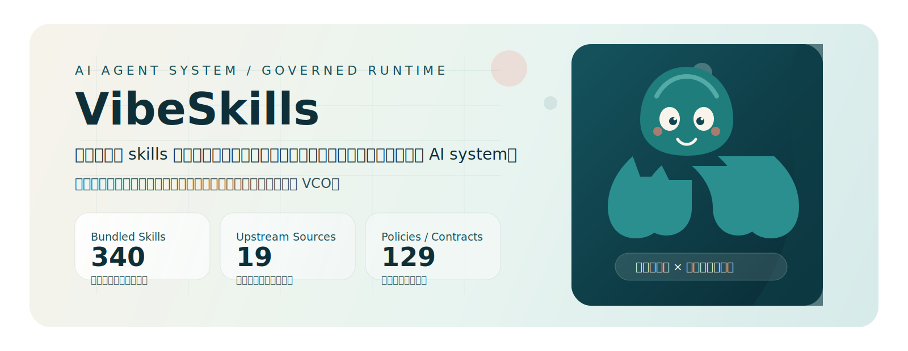

[English](./README.en.md)

  

  

<h1 align="center">VibeSkills</h1>

  <strong>不是另一个 skills 仓库。</strong> 
  它是一个把调用、治理、验证与留痕整合在一起的 AI agent system。

  
    <code>VibeSkills</code> 是公开名字，<code>VCO</code> 是它背后的 governed runtime。 
    小章鱼负责记忆点，受管运行时负责秩序感。
  

<table>
  <tr>
    <td width="33%" align="center" valign="top">
      <strong>340</strong> 
      bundled skills 
      不是散乱罗列，而是可被系统调用的能力面。
    </td>
    <td width="33%" align="center" valign="top">
      <strong>19</strong> 
      governed upstream sources 
      整合最前沿资源，但不让来源冲突直接暴露给用户。
    </td>
    <td width="33%" align="center" valign="top">
      <strong>129</strong> 
      config-backed policies and contracts 
      把治理密度直接做成系统表面，而不是事后补救。
    </td>
  </tr>
</table>

> `VibeSkills` 展示的不是静态目录，而是一套已经把能力规模、执行约束和治理密度压进同一平面的 AI system。

`VibeSkills` 是你看到的公开名字，`VCO` 是它背后的 governed runtime。

现在每个人都能感受到同一种压力：AI 工具越来越多，工作流越来越多，优秀资源层出不穷，但真正困难的从来不是“有没有工具”，而是怎么选择、怎么融合、怎么学习、怎么持续积累，以及怎么在这个变化过快的时代里不被抛下。

`VibeSkills` 就是为这种现实而生的。
它整合的是最前沿的工具集合，同时用一套完整、稳定、严苛的治理制度去管理这些优秀工具和资源，让你面对的不是一堆彼此冲突的能力碎片，而是一套更容易调用、更稳定执行、也更适合长期维护的系统。

## 为什么它会让人立刻感到不一样

很多 skills 仓库在回答一个问题：`这里有什么？`

`VibeSkills` 更在意的是另外几个问题：

- 现在该调用什么，而不是让你自己翻完整个技能表
- 应该先做什么，而不是让 AI 直接跳进执行
- 哪些能力可以安全组合，哪些地方必须设边界
- 完成之后怎么验证、怎么留痕、怎么避免长期黑盒化

它不是把能力堆得更多。
它是在把“调用、治理、验证、回看”整合成一个真正能工作的系统。

## 系统表面

<table>
  <tr>
    <td width="33%" valign="top">
      <strong>智能路由</strong> 
      逻辑路由与 AI 智能路由协同工作，尽量把正确能力放进正确上下文，而不是要求用户手动背完整个技能表。
    </td>
    <td width="33%" valign="top">
      <strong>受管工作流</strong> 
      需求澄清、确认、执行、验证、回顾、留痕被收进统一流程，让系统速度和系统可靠性同时存在。
    </td>
    <td width="33%" valign="top">
      <strong>整合能力</strong> 
      这里不只有 skills，还包括插件、项目、工作流设计、AI 规范、安全边界，以及长期维护经验。
    </td>
  </tr>
</table>

## 它真正解决的痛点

如果你已经在重度使用 AI，大概率已经遇到过这些问题：

- skills 太多，不知道当前场景到底该用哪个
- 项目、插件、工作流互相重叠，也互相冲突
- AI 没澄清需求就直接开做，速度很快，方向却不稳
- 做完之后没有验证、没有证据、没有回退面
- 随着使用变深，整个工作流越来越像一个没人说得清的黑盒

`VibeSkills` 不是假装这些问题不存在。
它的价值就在于正面处理这些问题。

## 它适合谁

`VibeSkills` 主要适合这几类人：

- 想让 AI 更稳定地帮自己做事的普通用户
- 已经在重度使用 AI / Agent / 自动化的进阶用户
- 想把 AI 工作流做得更规范、更可维护的个人或小团队
- 已经厌倦“技能太多但不好用”的人

如果你只是想找一个单点工具，这个仓库可能不是最轻的选择。
如果你想把 AI 用得更稳、更顺、更长期，它会更有意义。

## 快速入口

<table>
  <tr>
    <td width="33%" valign="top">
      <strong>先理解系统</strong> 
      从概览和理念开始，先判断这是不是你需要的工作方式。  
      <a href="./docs/quick-start.md">Quick Start</a> 
      <a href="./docs/manifesto.md">Manifesto</a>
    </td>
    <td width="33%" valign="top">
      <strong>一步式进入</strong> 
      如果你已经准备安装，直接进入公开安装入口。  
      <a href="./docs/install/one-click-install-release-copy.md">One-Click Install</a>
    </td>
    <td width="33%" valign="top">
      <strong>重度用户路径</strong> 
      想看更完整的安装方式、冷启动路径与上下游说明。  
      <a href="./docs/install/recommended-full-path.md">Recommended Full Path</a> 
      <a href="./docs/cold-start-install-paths.md">Cold Start Paths</a>
    </td>
  </tr>
</table>

## 一句话收尾

`VibeSkills` 想做的不是把项目说得更玄。
它想做的是把真实工作里最容易失控的那一部分，变成一个更可调用、更可治理、更可验证、也更可长期维护的 AI 系统。
